# Laporan Praktikum

### Pemrograman Berbasis Objek

Nama: Tyase Nisa'an Jamilaa

Kelas: 2C

NIM: 2241720012

### Percobaan 1: Membuat Class Diagram

Studi Kasus 1:
Dalam suatu perusahaan salah satu data yang diolah adalah data karyawan. Setiap karyawan memiliki id, nama, jenis kelamin, jabatan, jabatan, dan gaji. Setiap mahasiswa juga bisa menampilkan data diri pribadi dan melihat gajinya.

1. Gambarkan desain class diagram dari studi kasus 1!

   **jawab:**
   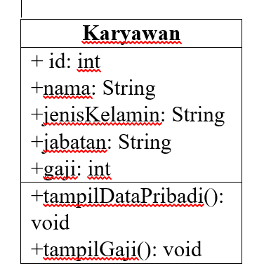

---

2. Sebutkan Class apa saja yang bisa dibuat dari studi kasus 1!

   **Jawab:**
   Class karyawan dan tampilKaryawan.

---

3.  Sebutkan atribut beserta tipe datanya yang dapat diidentifikasi dari masing-masing
    class dari studi kasus 1!

    **Jawab:**
    Id – int, nama – String, jenisKelamin – String, jabatan – String, gaji – int.

---

4.  Sebutkan method-method yang sudah anda buat dari masing-masing class pada studi
    kasus 1!

    **Jawab:**
    tampilDataPribadi(): void, tampilGaji(): void.

---

### Percobaan 2: Membuat dan mengakses anggota suatu class

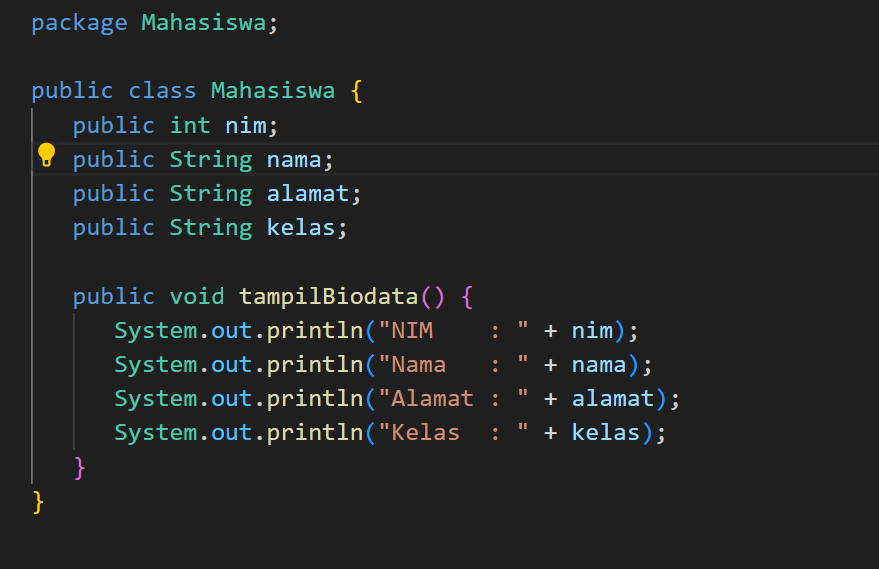
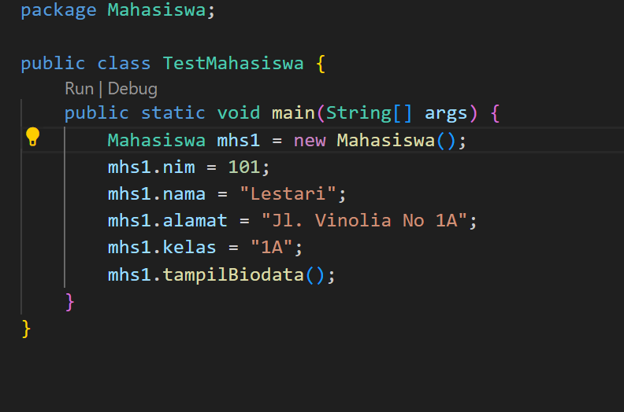
Hasil Percobaan:
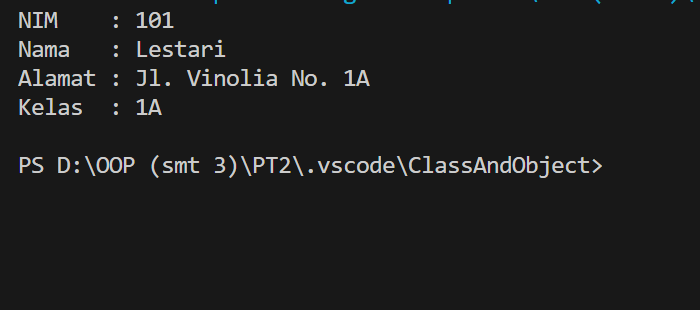

---

1. Jelaskan pada bagian mana proses pendeklarasian atribut pada program diatas!

   **Jawab:**
   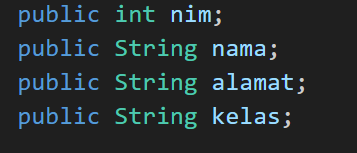

---

2. Jelaskan pada bagian mana proses pendeklarasian method pada program diatas!

   **Jawab:**
   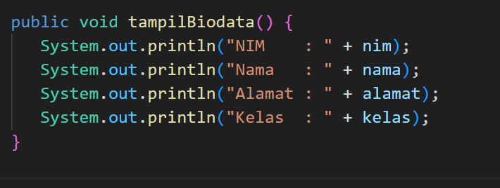

---

3. Berapa banyak objek yang di instansiasi pada program diatas!

   **Jawab:**
   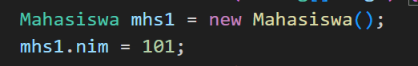

---

4. Apakah yang sebenarnya dilakukan pada sintaks program “mhs1.nim=101” ?

   **Jawab:**
   Pada program mhs1.nim = 101, program melakukan inisialisasi atribut nim dari objek mhs1 dengan nilai 101.

---

5. Apakah yang sebenarnya dilakukan pada sintaks program “mhs1.tampilBiodata()” ?

   **Jawab:**
   Pada sintaks program mhs1.tampilBiodata(), program memanggil metode tampilBiodata() yang ada dalam objek mhs1 dari kelas Mahasiswa.

---

6. Instansiasi 2 objek lagi pada program diatas!

   **Jawab:**
   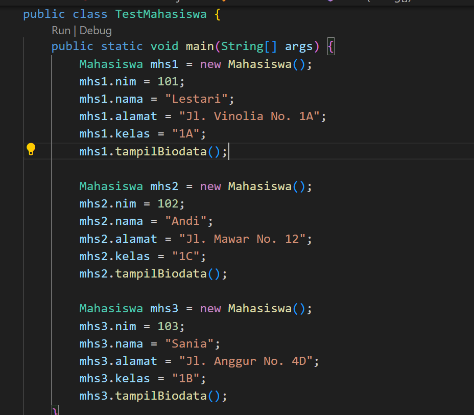
   Hasil:
   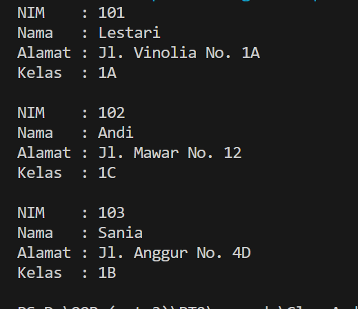

---

### Percobaan 3: Menulis method yang memiliki argument/parameter dan memiliki return.

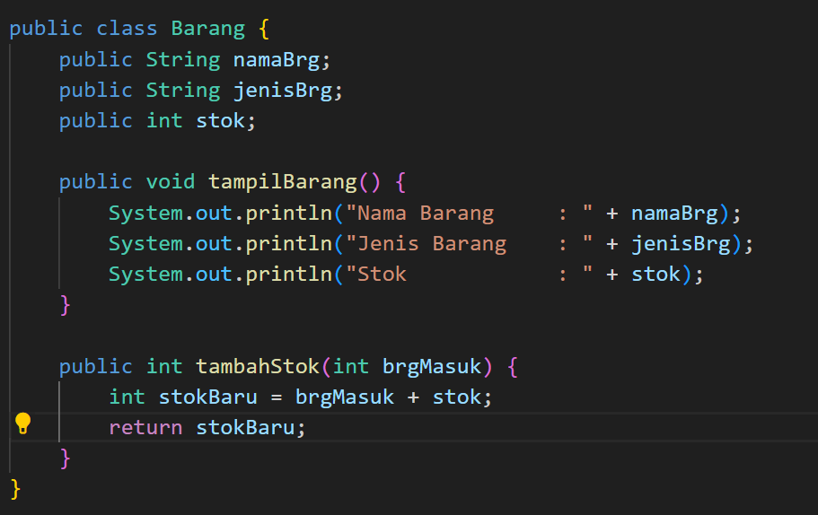
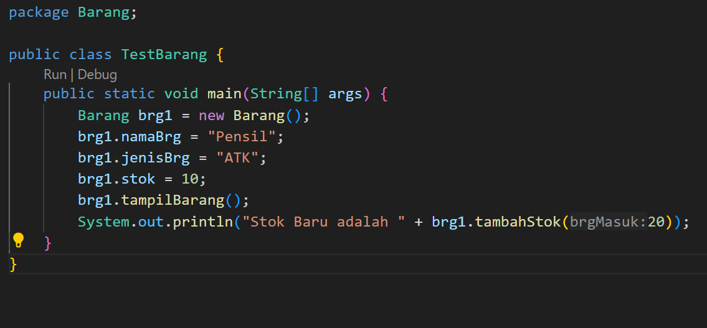
Hasil Percobaan:
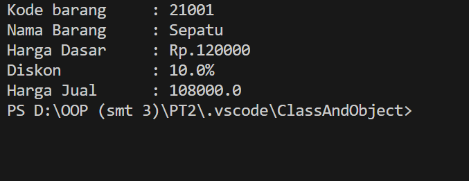

---

1. Apakah fungsi argumen dalam suatu method?

   **Jawab:** Melakukan tugas tertentu atau mengembalikan nilai berdasarkan informasi yang Anda berikan. Dalam kasus metode tambahStok pada kelas Barang, brgMasuk adalah argumen yang diterima oleh metode tersebut.

---

2.  Ambil kesimpulan tentang kegunaan dari kata kunci return , dan kapan suatu method
    harus memiliki return!

        **Jawab:** Return digunakan untuk mengembalikan nilai dari sebuah metode (fungsi) kepada pemanggilnya. Ini memungkinkan metode untuk mengirimkan data atau hasil komputasi yang dapat digunakan atau diolah oleh bagian program lain. Suatu method harus memiliki return pada saat method memiliki nilai yang ingin dikembalikan dan akan digunakan oleh bagian program lain.

---

### Tugas

1. Suatu toko persewaan video game salah satu yang diolah adalah peminjaman, dimana
   data yang dicatat ketika ada orang yang melakukan peminjaman adalah id, nama
   member, nama game, dan harga yang harus dibayar. Setiap peminjaman bisa
   menampilkan data hasil peminjaman dan harga yang harus dibayar. Buatlah class
   diagram pada studi kasus diatas!
   Penjelasan:
   • Harga yang harus dibayar diperoleh dari lama sewa x harga.
   • Diasumsikan 1x transaksi peminjaman game yang dipinjam hanya 1 game saja.

**Jawab:**
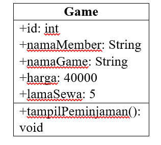

---

2. Buatlah program dari class diagram yang sudah anda buat di no 1!

   **Jawab:**
   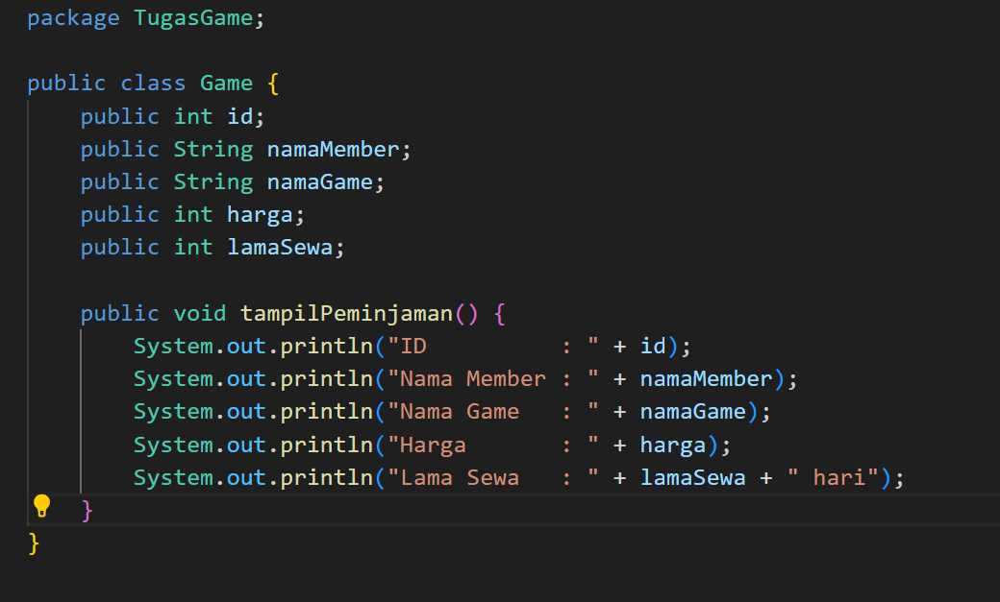
   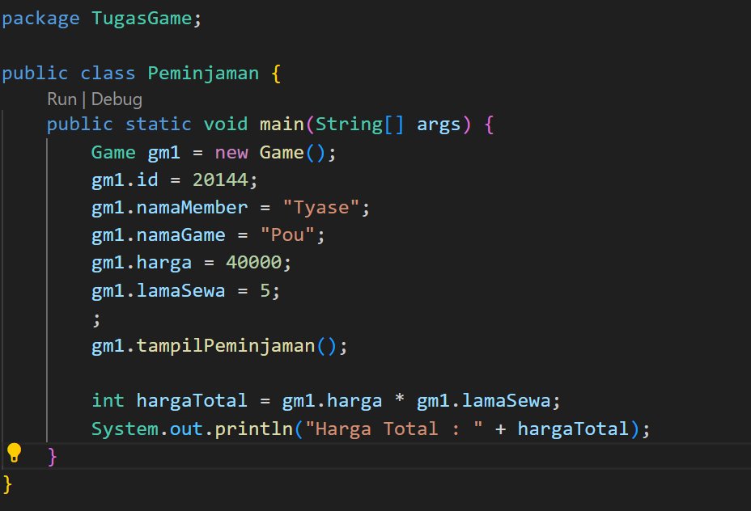

   Hasil:
   

---

3. Buatlah program sesuai dengan class diagram berikut ini:

   **Jawab:**
   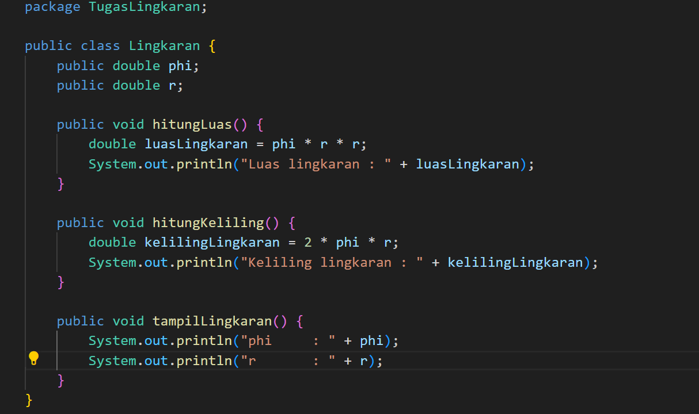
   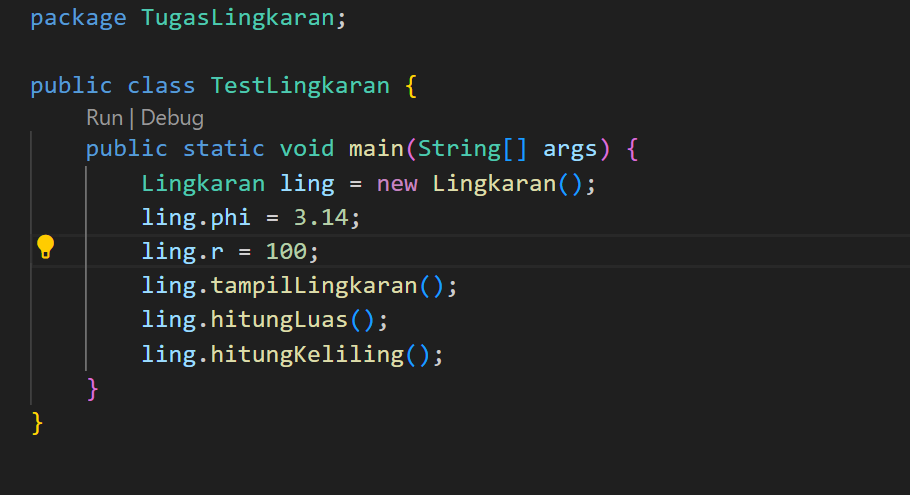

   Hasil:
   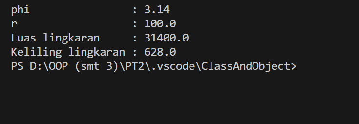

---

4. Buatlah program sesuai dengan class diagram berikut ini:

   **Jawab:**
   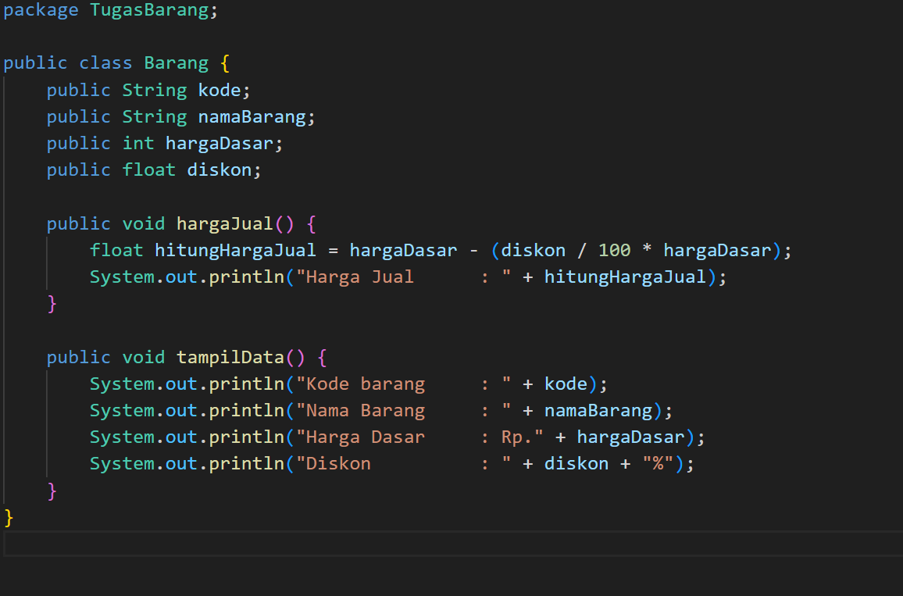
   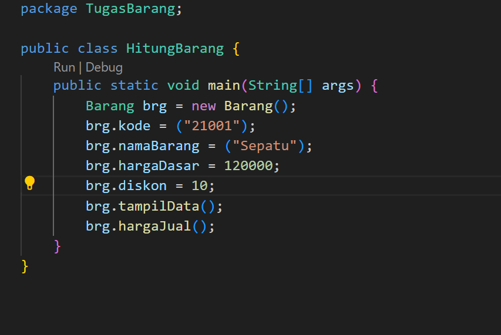

   Hasil:
   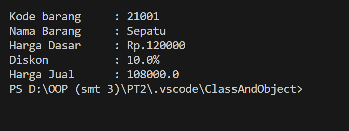
