# Laporan Praktikum

### Pemrograman Berbasis Objek

Nama: Tyase Nisa'an Jamilaa

Kelas: 2C

NIM: 2241720012

---

## Percobaan 1 – Bentuk dasar polimorfisme

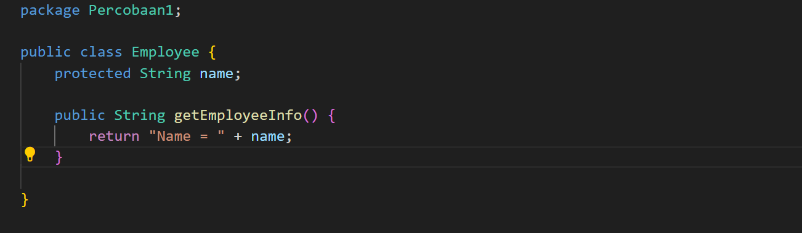

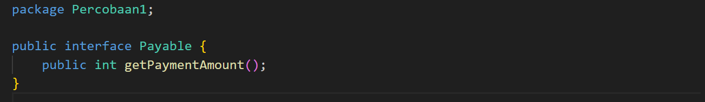

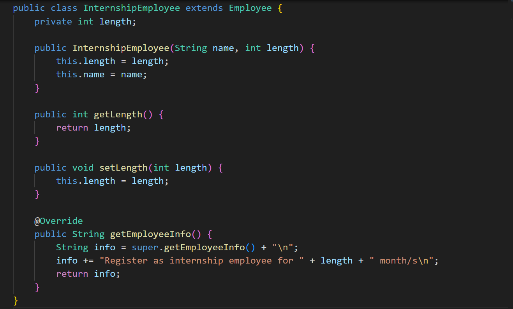

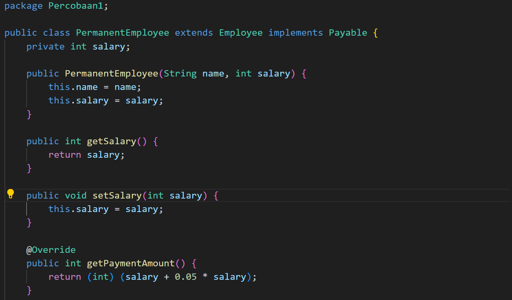

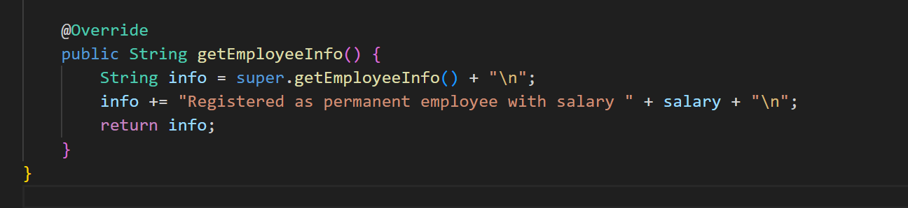

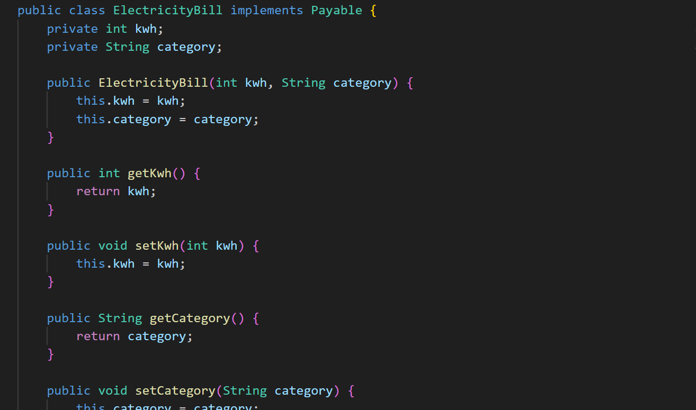

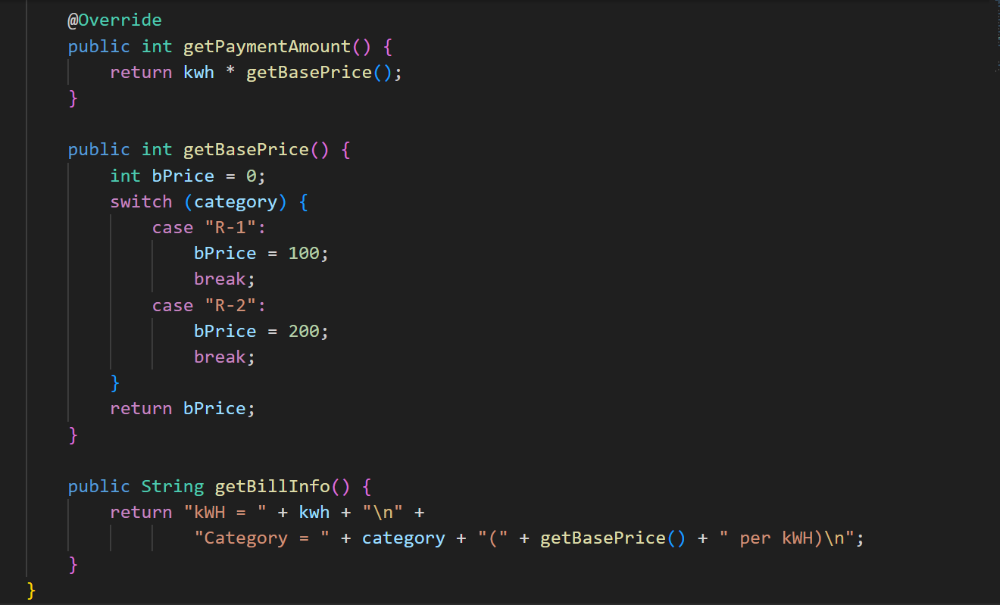

---

### Pertanyaan

1.  Class apa sajakah yang merupakan turunan dari class Employee?

    **Jawab:**
    Class yang merupakan turunan dari kelas Employee adalah InternshipEmployee dan PermanentEmployee

2.  Class apa sajakah yang implements ke interface Payable?

    **Jawab:**
    Class yang merupakan implements ke interface Payable adalah PermanentEmployee dan ElectricityBill

3.  Perhatikan class Tester1, baris ke-10 dan 11. Mengapa e, bisa diisi dengan objek pEmp (merupakan objek dari class PermanentEmployee) dan objek iEmp (merupakan objek dari class InternshipEmploye) ?

    **Jawab:**
    Pada baris 10 dan 11 Tester1, e adalah variabel bertipe Employee, yang artinya itu dapat menunjuk ke objek dari kelas mana pun yang merupakan subclass dari Employee (InternshipEmployee (iEmp) dan PermanentEmployee (eEmp)).

4.  Perhatikan class Tester1, baris ke-12 dan 13. Mengapa p, bisa diisi denganobjekpEmp (merupakan objek dari class PermanentEmployee) dan objek eBill (merupakan objek dari class ElectricityBill) ?

    **Jawab:**
    Pada baris 12 dan 13, variabel p dapat diisi dengan objek pEmp (objek dari class PermanentEmployee) dan objek eBill (objek dari class ElectricityBill) karena keduanya mengimplementasikan interface Payable. Sehingga class tersebut dianggap "menjadi" interface tersebut dan mendapatkan kemampuan untuk dianggap sebagai tipe data dari interface tersebut.

5.  Coba tambahkan sintaks: p = iEmp; e = eBill, pada baris 14 dan 15 (baris terakhir dalam method main) ! Apa yang menyebabkan error?

    **Jawab:**

    Pada baris 14: e = eBill;

    e dideklarasikan sebagai objek dari kelas Employee. Namun, eBill merupakan objek dari kelas ElectricityBill. Ini dapat menyebabkan error karena objek dari tipe yang tidak sesuai tidak dapat diassign secara langsung ke variabel dengan tipe yang berbeda.

    Pada baris 15: p = iEmp;

    p dideklarasikan sebagai objek dari antarmuka Payable. iEmp merupakan objek dari kelas InternshipEmployee. Jika InternshipEmployee tidak mengimplementasikan antarmuka Payable, ini juga dapat menyebabkan error.

6.  Ambil kesimpulan tentang konsep/bentuk dasar polimorfisme!

    **Jawab:** Konsep dasar polimorfisme terlihat dalam penggunaan inheritance, overriding, dan implementasi interface. Polimorfisme memungkinkan penggunaan referensi dari tipe yang sama untuk merujuk ke objek yang berbeda dan memanggil metode yang didefinisikan oleh objek yang sebenarnya pada saat runtime.

    - Inheritance (Pewarisan): Kelas InternshipEmployee dan PermanentEmployee mewarisi sifat dan perilaku dari kelas Employee. Keduanya menggunakan metode getEmployeeInfo() dari kelas induk (Employee) tetapi memberikan implementasi yang berbeda.

    - Overriding (Penggantian Metode): Metode getEmployeeInfo() dioverride di kelas InternshipEmployee dan PermanentEmployee untuk memberikan informasi yang spesifik terkait jenis karyawan (internship atau permanent).

    - Implementasi Interface: Kelas ElectricityBill, PermanentEmployee, dan Tester1 menggunakan interface Payable. Mereka mengimplementasi metode getPaymentAmount() sesuai dengan kebutuhan masing-masing kelas.

---

## Percobaan 2

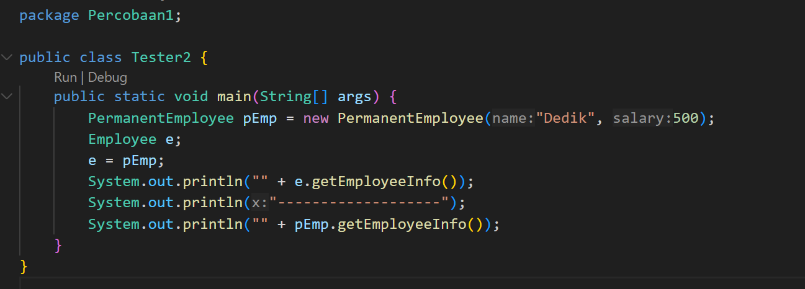

Hasil Percobaan:

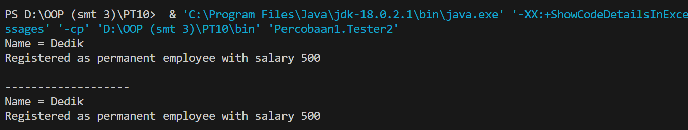

---

### Pertanyaan – Virtual method invocation

1. Perhatikan class Tester2 di atas, mengapa pemanggilan e.getEmployeeInfo() pada baris 8 dan pEmp.getEmployeeInfo() pada baris 10 menghasilkan hasil sama?

   **Jawab:**
   Pada baris 8 dan 10, hasil yang sama terjadi karena penggunaan polimorfisme. e.getEmployeeInfo() maupun pEmp.getEmployeeInfo() menghasilkan output yang sama karena keduanya merujuk pada objek yang sama, yaitu objek pEmp yang merupakan instance dari PermanentEmployee.

2. Mengapa pemanggilan method e.getEmployeeInfo() disebut sebagai pemanggilan method virtual (virtual method invication), sedangkan pEmp.getEmployeeInfo() tidak?

   **Jawab:**
   Pemanggilan metode e.getEmployeeInfo() disebut sebagai pemanggilan metode virtual (virtual method invocation) karena metode yang dipanggil adalah milik objek yang ditunjuk oleh referensi dinamis e, bukan referensi statis pEmp.

   Sementara itu, saat memanggil pEmp.getEmployeeInfo(), tidak ada perubahan referensi statis. Sehingga pemanggilan metode tidak disebut sebagai pemanggilan metode virtual dalam konteks ini karena implementasi metode yang digunakan telah ditentukan secara langsung oleh jenis objek yang digunakan

3. Jadi apakah yang dimaksud dari virtual method invocation? Mengapa disebut virtual?

   **Jawab:**
   Virtual method invocation adalah konsep dalam pemrograman berorientasi objek di mana pemanggilan metode dilakukan pada waktu runtime, dan metode yang akan dipanggil ditentukan berdasarkan objek aktual yang sedang diproses, bukan pada waktu kompilasi berdasarkan tipe variabel. Istilah "virtual" mengacu pada fakta bahwa metode yang dipanggil dapat berubah berdasarkan objek yang sebenarnya sedang diproses pada saat runtime, memungkinkan untuk polimorfisme.

   Contoh kode adalah metode getEmployeeInfo() dipanggil melalui variabel e yang merupakan objek dari kelas PermanentEmployee, metode yang dipanggil adalah versi yang dioverride dalam kelas PermanentEmployee.

---

## Percobaan 3 – Heterogenous Collection

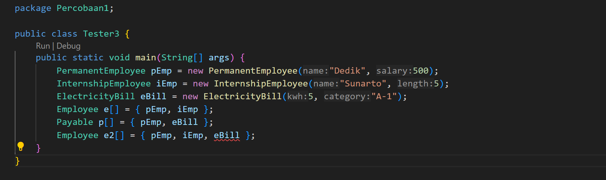

---

### Pertanyaan

1. Perhatikan array e pada baris ke-8, mengapa ia bisa diisi dengan objekobjek dengan tipe yang berbeda, yaitu objek pEmp (objek dari PermanentEmployee) dan objek iEmp (objek dari InternshipEmployee) ?

   **Jawab:**
   Pada baris ke-8, array e dideklarasikan sebagai array dari objek Employee: Employee e[]. Ini memungkinkan array e untuk menyimpan objek dari kelas-kelas yang merupakan turunan dari kelas Employee, seperti PermanentEmployee dan InternshipEmployee. Sehingga, walaupun objek tersebut sebenarnya adalah instansi dari kelas yang berbeda, karena mereka merupakan turunan dari kelas yang sama, mereka dapat disimpan dalam array yang memiliki tipe kelas induknya.

2. Perhatikan juga baris ke-9, mengapa array p juga diisi dengan objek-objek dengan tipe yang berbeda, yaitu objek pEmp (objek dari PermanentEmployee) dan objek eBill (objek dari ElectricityBilling) ?

   **Jawab:**
   Pada baris ke-9 dari kode Tester3 objek pEmp dari PermanentEmployee maupun objek eBill dari ElectricityBill dapat disimpan dalam array p dan e2 karena keduanya mengimplementasikan interface Payable. Ini memanfaatkan konsep polimorfisme di mana objek dari kelas yang berbeda dapat diakses melalui referensi yang sama.

3. Perhatikan baris ke-10, mengapa terjadi error?

   **Jawab:**
   Pada baris ke-10 terjadi kesalahan karena nilai string yang diberikan pada saat pembuatan objek ElectricityBill tidak sesuai dengan kategori yang telah ditentukan dalam kelas ElectricityBill. Kelas ElectricityBill memiliki kategori yang diizinkan yaitu "R-1" dan "R-2". Pada baris ke-10, kategori yang diberikan adalah "A-1", yang tidak cocok dengan kategori yang telah ditentukan di dalam kelas ElectricityBill. Karena itu, ini menyebabkan kesalahan pada pembuatan objek ElectricityBill.

---

## Percobaan 4 – Argumen polimorfisme, instanceof dan casting objek

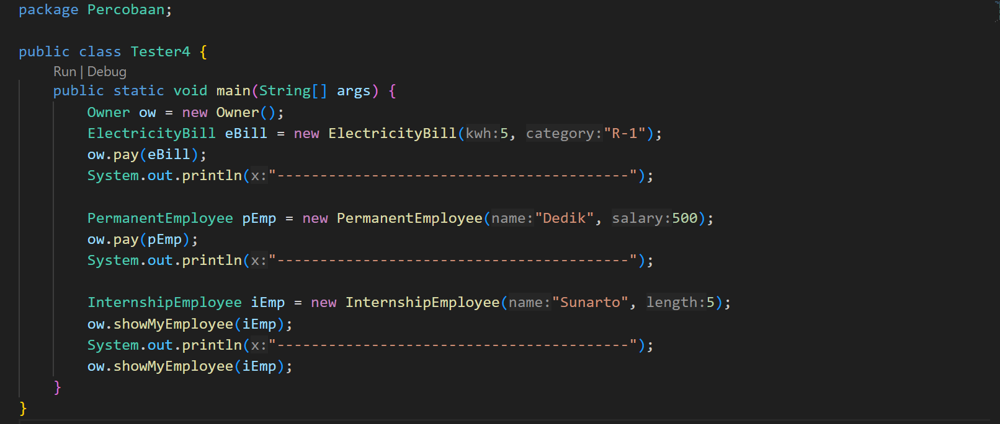

Hasil Percobaan:

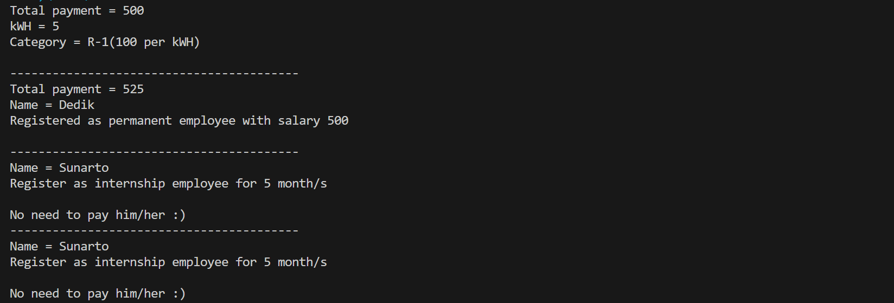

---

### Pertanyaan

1. Perhatikan class Tester4 baris ke-7 dan baris ke-11, mengapa pemanggilan ow.pay(eBill) dan ow.pay(pEmp) bisa dilakukan, padahal jika diperhatikan method pay() yang ada di dalam class Owner memiliki argument/parameter bertipe Payable?Jika diperhatikan lebih detil eBill merupakan objek dari ElectricityBill dan pEmp merupakan objek dari PermanentEmployee?

   **Jawab:**
   Pemanggilan ow.pay(eBill) dan ow.pay(pEmp) pada metode pay() di dalam kelas Owner bisa dilakukan karena kelas ElectricityBill dan PermanentEmployee keduanya mengimplementasikan antarmuka Payable. Walaupun metode pay() menerima parameter bertipe Payable, kelas ElectricityBill dan PermanentEmployee menerapkan iterface (antarmuka) Payable melalui implementasi metode getPaymentAmount() yang diperlukan oleh antarmuka Payable.

2. Jadi apakah tujuan membuat argument bertipe Payable pada method pay() yang ada di dalam class Owner?

   **Jawab:**
   Argumen bertipe Payable pada method pay() di kelas Owner memungkinkan kelas Owner untuk menerima berbagai objek yang mengimplementasikan interface Payable. Dengan cara ini, Owner bisa menerima objek dari kelas-kelas yang berbeda namun memiliki kemampuan untuk memberikan informasi pembayaran (melalui metode getPaymentAmount()).

3. Coba pada baris terakhir method main() yang ada di dalam class Tester4 ditambahkan perintah ow.pay(iEmp);

   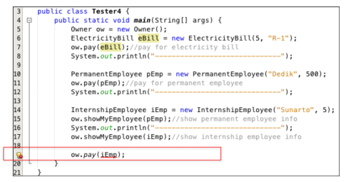

   Mengapa terjadi error?

   **Jawab:**
   Error terjadi karena kelas InternshipEmployee tidak mengimplementasikan interface Payable. Metode pay dalam kelas Owner menerima objek yang mengimplementasikan interface Payable, sehingga tidak dapat langsung menggunakan pay dengan objek dari kelas InternshipEmployee yang tidak mengimplementasikan interface tersebut.

4. Perhatikan class Owner, diperlukan untuk apakah sintaks p instanceof ElectricityBill pada baris ke-6 ?

   **Jawab:**
   Sintaks p instanceof ElectricityBill digunakan untuk memeriksa apakah objek yang diterima sebagai parameter p merupakan instance dari kelas ElectricityBill.

5. Perhatikan kembali class Owner baris ke-7, untuk apakah casting objek disana (ElectricityBill eb (ElectricityBill) p) diperlukan ? Mengapa objek p yang bertipe Payable harus di-casting ke dalam objek eb yang bertipe ElectricityBill ?

   **Jawab:**
   Casting (ElectricityBill) p digunakan untuk mengubah referensi p (yang secara generik bertipe Payable) menjadi tipe yang lebih spesifik (ElectricityBill) sehingga kita dapat mengakses metode atau properti yang hanya dimiliki oleh ElectricityBill. Pada kondisi if (p instanceof PermanentEmployee) di mana objek p yang bertipe Payable di-casting ke PermanentEmployee untuk mengakses fitur-fitur spesifik dari kelas PermanentEmployee.

---

## Tugas

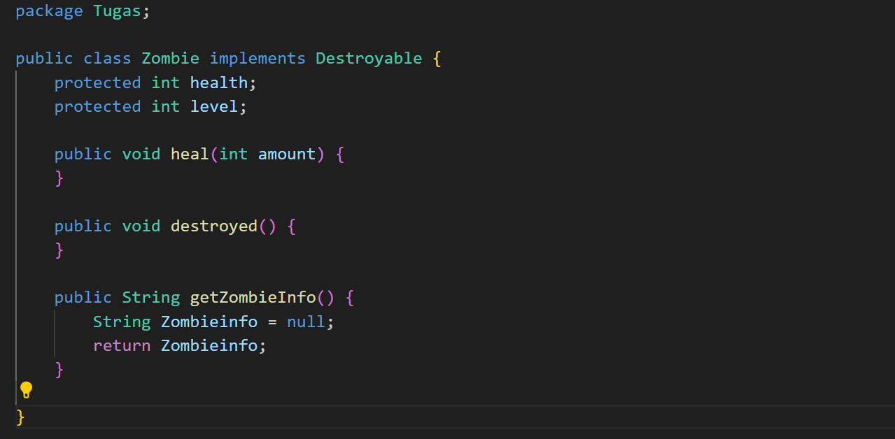

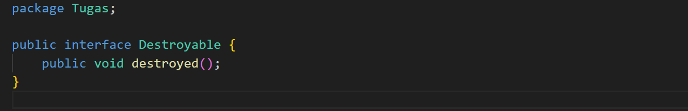

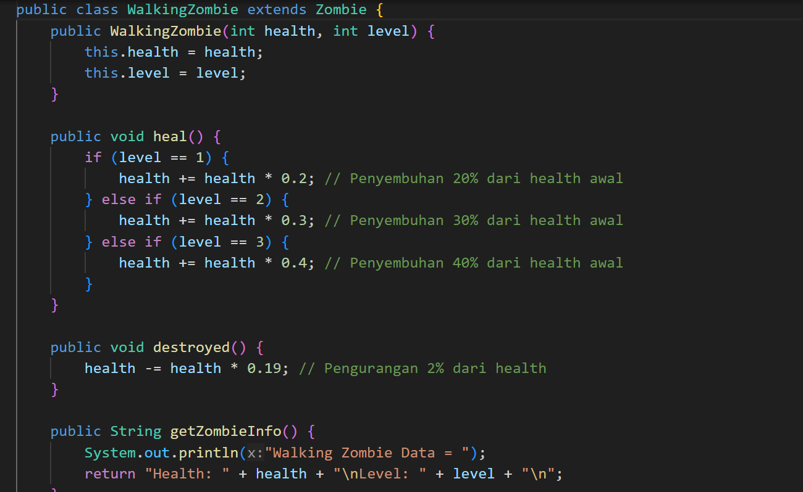

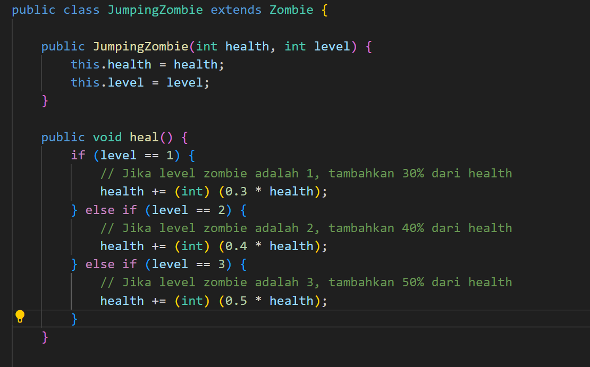

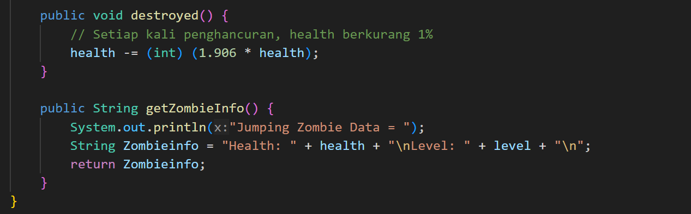

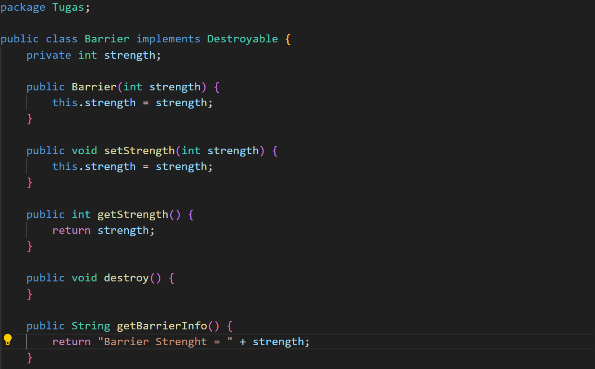

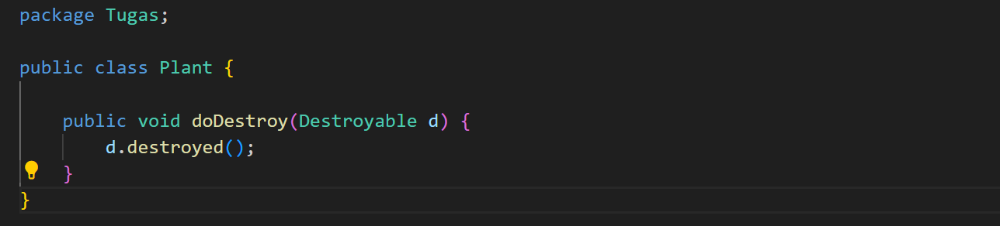

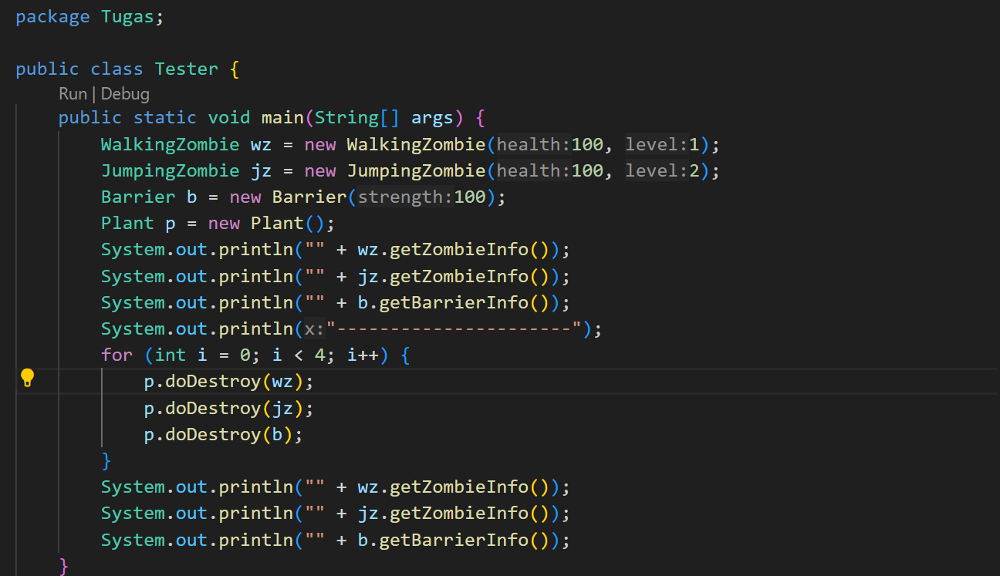

Hasil Percobaan:

