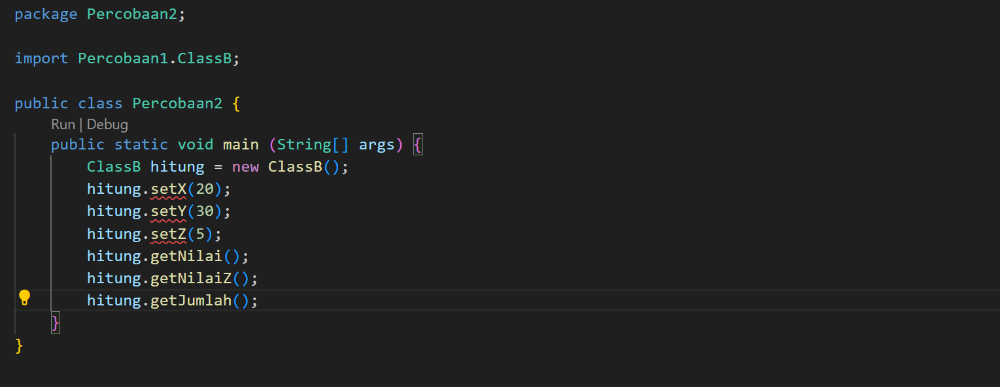

# Laporan Praktikum

### Pemrograman Berbasis Objek

Nama: Tyase Nisa'an Jamilaa

Kelas: 2C

NIM: 2241720012

---

### Percobaan 1 (Extends)

**Penjelasan:** Pada program ini menggunakan konsep pewarisan(Inheritance) yang memungkinkan ClassB mengakses variabel x dan y yang didefinisikan dalam ClassA.

---

### Pertanyaan

1. Pada percobaan 1 diatas program yang dijalankan terjadi error, kemudian perbaiki sehingga program tersebut bisa dijalankan dan tidak error!

   **Jawab:**
   

   

   

   Hasil Percobaan:

   

2. Jelaskan apa penyebab program pada percobaan 1 ketika dijalankan terdapat error!

   **Jawab:** Pada kode tersebut terjadi error karena variabel x dan y yang digunakan dalam method getJumlah pada class B tidak dideklarasikan dalam kelas, sehingga tidak dapat diakses dari class lain.

---

### Percobaan 2 (Hak Akses)

**Penjelasan:** Pada kode program ini menggunakan konsep pewarisan(Inheritance) dimana memmungkinkan ClassB* untuk mengakses variabel x dan y pada ClassA* dan menambahkan variabelz sebagai method tambahan.

---

1.  Pada percobaan 2 diatas program yang dijalankan terjadi error, kemudian perbaiki sehingga program tersebut bisa dijalankan dan tidak error!

    **Jawab:**
    

    

    

    Hasil Pemrograman:

    

2.  Jelaskan apa penyebab program pada percobaan 1 ketika dijalankan terdapat error!

    **Jawab:** Karena pada program deklarasi variabel x dan y pada ClassA\_ adalah private, sehingga variabel tersebut hanya dapat diakses langsung dari dalam kelas yang mendeklarasikannya. Untuk perbaikannya bisa mengganti menggunakan protected atau public agar program bisa berjalan dengan baik.

---

### Percobaan 3 (Super)

Hasil Percobaan:

### Pertanyaan

1. Jelaskan fungsi “super” pada potongan program berikut di class Tabung!

   

   **Jawab:** Fungsi super adalah untuk merujuk ke variabel atau method yang berasal dari superclass atau kelas induk dari kelas saat ini.

   - Pada super.phi = phi; digunakan untuk merujuk pada variabel "phi" yang ada pada superclass "Bangun". Variabel bersifat protected sehingga dapat diakses oleh subclass "Tabung".

   - Pada super.r = r; digunakan untuk merujuk "r" yang ada dalam superclass "Bangun". Seperti sebelumnya, "super" digunakan untuk mengakses variabel "r" dari superclass dan mengatur nilainya dengan nilai yang diteruskan sebagai argumen "r" ke method.

2. Jelaskan fungsi “super” dan “this” pada potongan program berikut di class Tabung!

   

   **Jawab:**

   - "super" digunakan untuk merujuk ke variabel atau method dari superclass. Dalam kode kali ini, "super" digunakan untuk mengakses variabel phi dan r yang ada pada superclass, yaitu class 'Bangun', sehingga nilai phi dan r dapat kita akses pada subclass.

   - "this" digunakan untuk merujuk pada variabel atau method dari objek pada class saat ini. Dalam kode ini, "this.t" digunakan untuk merujuk variabel t yang terdapat pada class Tabung dengan menggunakan method setT.

3. Jelaskan mengapa pada class Tabung tidak dideklarasikan atribut “phi” dan “r” tetapi class tersebut dapat mengakses atribut tersebut!

   **Jawab:** Karena class 'Tabung' mewarisi class 'Bangun', sehingga dapat mewarisi atribut phi dan r pada class 'Bangun'. Pengksesan pada superclass dapat dijangkau dengan menggunakan kata kunci "super".

---

### Percobaan 4 (Super Contsructor)

Hasil Percobaan:

---

### Pertanyaan

1.  Pada percobaan 4 sebutkan mana class yang termasuk superclass dan subclass, kemudian
    jelaskan alasannya!

        superclass:

        - **ClassA** tidak memiliki superclass lain.

        subclass:

        - **ClassB** adalah subclass dari ClassA, sehingga mewarisi semua atribut dan method yang ada di ClassA.

        - **ClassC** adalah subclass dari ClassB, sehingga mewarisi semua atribut dan method yang ada di ClassB, yang juga termasuk warisan dari ClassA.

2.  Ubahlah isi konstruktor default ClassC seperti berikut:

    

    Tambahkan kata super() di baris Pertaman dalam konstruktor defaultnya. Coba jalankan
    kembali class Percobaan4 dan terlihat tidak ada perbedaan dari hasil outputnya!

    Hasil Percobaan:

    

    Hasil percobaan tetap sama sebelumnya, fungsi 'super()' akan merujuk pada konstruktor pada parent class.

3.  Ublah isi konstruktor default ClassC seperti berikut:

    

    Ketika mengubah posisi super() dibaris kedua dalam kontruktor defaultnya dan terlihat ada error. Kemudian kembalikan super() kebaris pertama seperti sebelumnya, maka errornya akan hilang.Perhatikan hasil keluaran ketika class Percobaan4 dijalankan. Kenapa bisa tampil output seperti berikut pada saat instansiasi objek test dari class ClassC

    

    Jelaskan bagaimana urutan proses jalannya konstruktor saat objek test dibuat!

    **Jawab:** Dalam percobaan kali ini, terdapat tiga class yang saling berhubungan, dimana ClassC adalah subclass dari ClassB, dan ClassB adalah subclass dari ClassA. Sebagai superclass, konstruktor ClassA akan di jalankan terlebih dahulu, diikuti dengan ClassB, lalu ClassC sebagai subclass.

4.  Apakah fungsi super() pada potongan program dibawah ini di ClassC!

    

    **Jawab:** Untuk memanggil konstruktor dari superclass, yaitu ClassB.

---

### Tugas

Buatlah sebuah program dengan konsep pewarisan seperti pada class diagram berikut ini.
Kemudian buatlah instansiasi objek untuk menampilkan data nama pegawai dan gaji yang
didapatkannya.

Hasil Percobaan:

