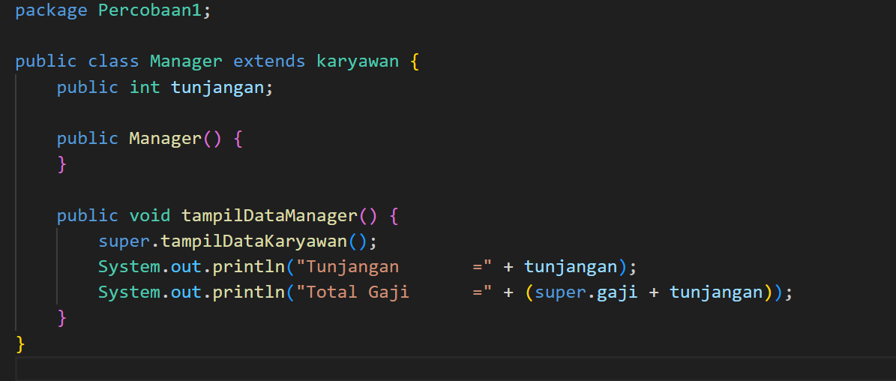

# Laporan Praktikum

### Pemrograman Berbasis Objek

Nama: Tyase Nisa'an Jamilaa

Kelas: 2C

NIM: 2241720012

---

### Percobaan 1

Hasil Percobaan:

---

# Pertanyaan

1.  Sebutkan class mana yang termasuk super class dan sub class dari percobaan 1 diatas!

    **Jawab:** Yang merupakan super class adalah class _Karyawan_, sedangkan sub class adalah class _Staff_ dan _Manager_.

2.  Kata kunci apakah yang digunakan untuk menurunkan suatu class ke class yang lain?

    **Jawab:** Kata kunci yang digunakan untuk menurunkan suatu class ke class yang lain adalah extends. Contoh penerapan kode extends terdapat pada class Staff dan class Manager.

3.  Perhatikan kode program pada class Manager, atribut apa saja yang dimiliki oleh class
    tersebut? Sebutkan atribut mana saja yang diwarisi dari class Karyawan!

        **Jawab:** Atribut yang dimiliki oleh class Manager adalah tunjangan dengan nilai int, sementara atribut yang diwarisi dari class Karyawan adalah gaji(int).

4.  Jelaskan kata kunci super pada potongan program dibawah ini yang terdapat pada class
    Manager!

    **Jawab:** Kode "super" pada class Manager digunakan untuk merujuk ke super class (kelas induk) yaitu pada class Karyawan, dimana "super.gaji" dugunakan untuk mengakses variabel gaji yang didefinisikan dalam kelas karyawan

5. Program pada percobaan 1 diatas termasuk dalam jenis inheritance apa? Jelaskan alasannya!

   **Jawab** Pada program percobaan 1 diatas termasuk dalam jenis single inheritance, di mana sebuah sub class hanya dapat meng-extend satu super class saja.

### Percobaan 2

Hasil Percobaan:

---

### Pertanyaan

1.  Berdasarkan class diatas manakah yang termasuk single inheritance dan mana yang termasuk multilevel inheritance?

    **Jawab:** Yang termasuk single inheritance adalah class Staff dan Manager, sedangkan yang termasuk multilevel inheritance adalah class StaffHarian dan StaffTetap

2.  Perhatikan kode program class StaffTetap dan StaffHarian, atribut apa saja yang
    dimiliki oleh class tersebut? Sebutkan atribut mana saja yang diwarisi dari class
    Staff!

        **Jawab:** Atribut pada class StafTetap adalah golongan (string) & asuransi (int), sementara yang diwarisi dari class Staff adalah nama (String), alamat (String), jk (STring), umur (int), gaji (int), lembur (int), potongan (int). Atribut pada class StafHarian adalah jmlJamKerja (int), sementara yang diwarisi dari class Staff adalah nama (String), alamat (String), jk (STring), umur (int), gaji (int), lembur (int), potongan (int).

3.  Apakah fungsi potongan program berikut pada class StaffHarian

    **Jawab:** Kode tersebut digunakan untuk memanggil konstruktor dari super class yang digunkan untuk menginisialisasi tribut-atribut dari kelas Staff yang menjadi superclass dari StaffHarian.

4. Apakah fungsi potongan program berikut pada class StaffHarian

    **Jawab:** Kode tersebut digunakan untuk memanggil method tampilDataStaff dari class Staff (superclass), untuk menampilkan seluruh data dari method tampilDataStaff dalam class Staff.

5. Perhatikan kode program dibawah ini yang terdapat pada class StaffTetap

Terlihat dipotongan program diatas atribut gaji, lembur dan potongan dapat diakses langsung. Kenapa hal ini bisa terjadi dan bagaimana class StaffTetap memiliki atribut gaji, lembur, dan potongan padahal dalam class tersebut tidak dideklarasikan atribut gaji, lembur, dan potongan?

    **Jawab:** Karena class Stafftetap adalah inheritance dari class Staff, sehingga  semua atribut dan metode non-private yang ada dalam superclass juga diwarisi oleh subclass. Oleh karena itu, dalam class StaffHarian dan StaffTetap, Anda dapat mengakses atribut gaji, lembur, dan potongan yang dideklarasikan di class Staff, tanpa perlu mendeklarasikannya lagi di subclass tersebut.

### Tugas

Hasil Prcobaan:

