# Laporan Praktikum

### Pemrograman Berbasis Objek

Nama: Tyase Nisa'an Jamilaa

Kelas: 2C

NIM: 2241720012

---

### Percobaan 1

Karyawan:

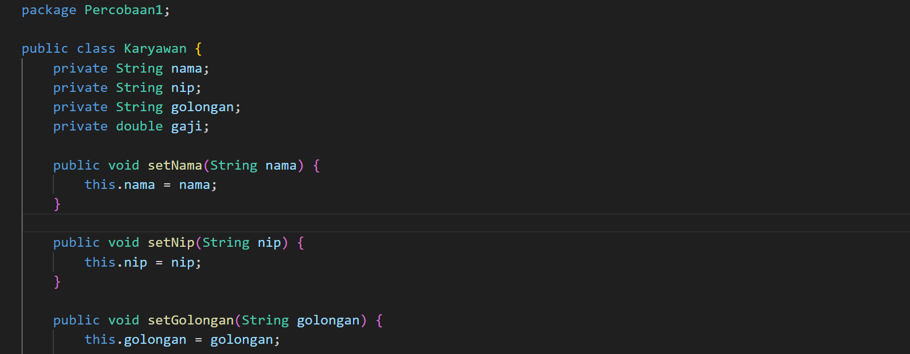
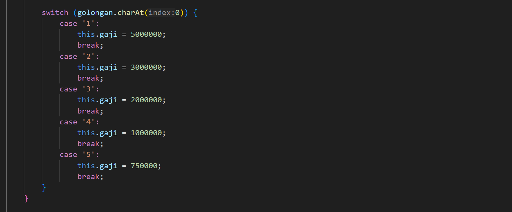
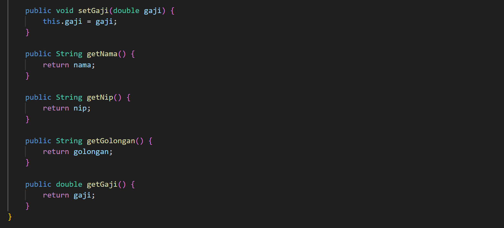

Manager:

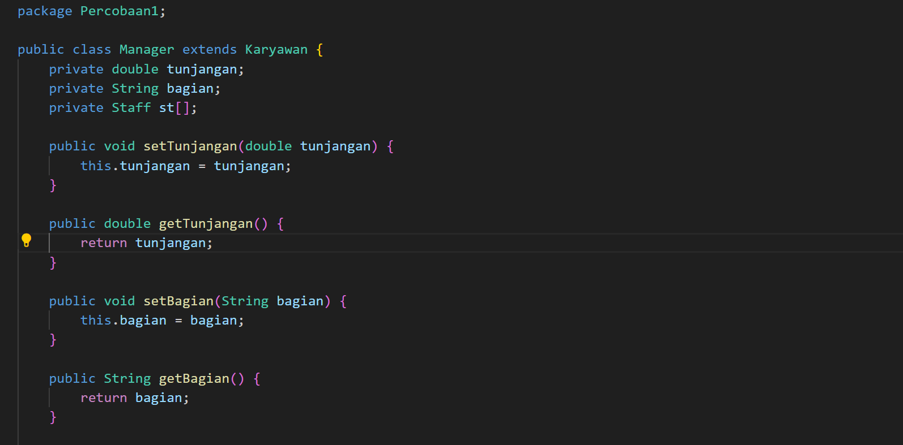
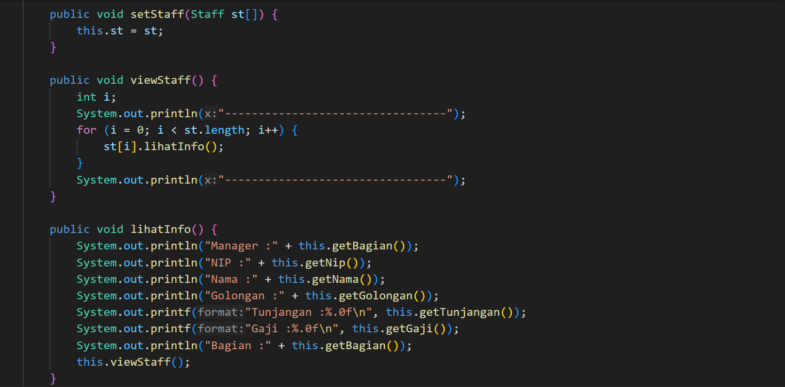
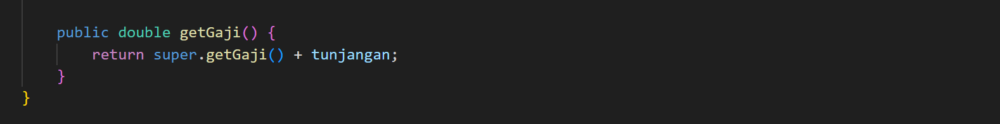

Staff:

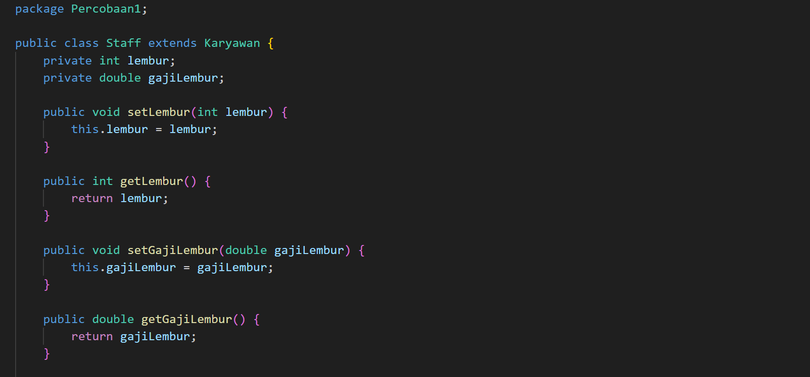
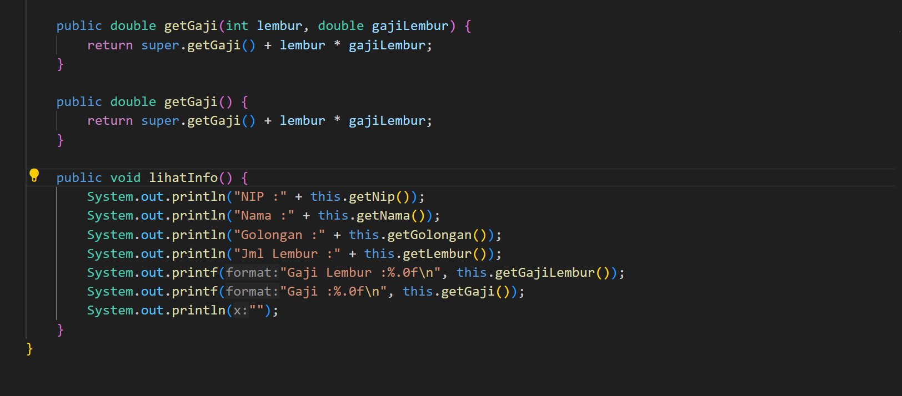

Utama:

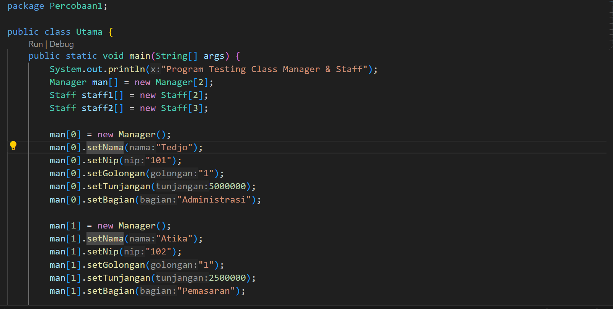
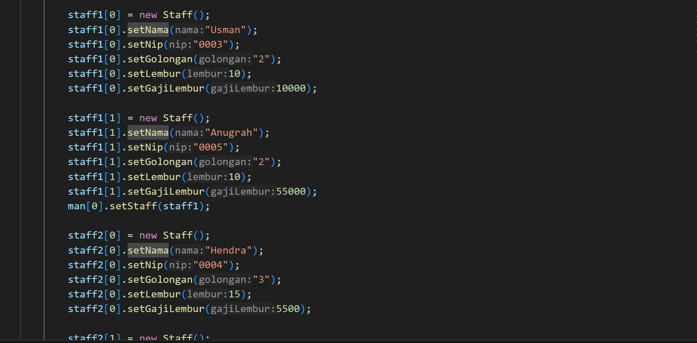
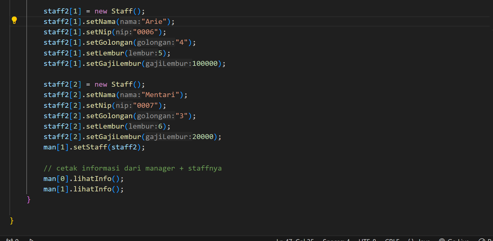

Hasil Pemrograman:

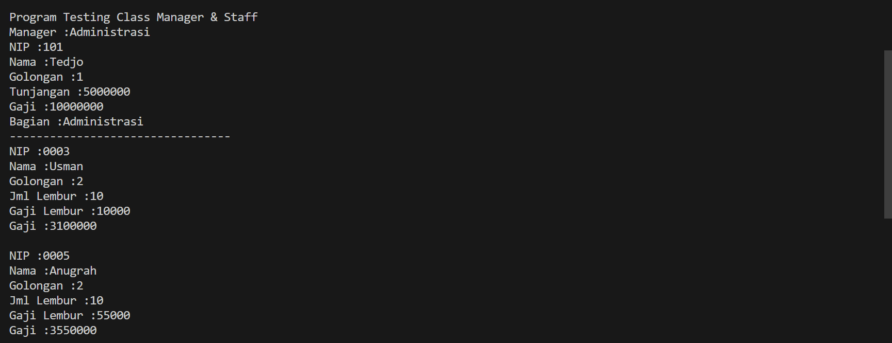
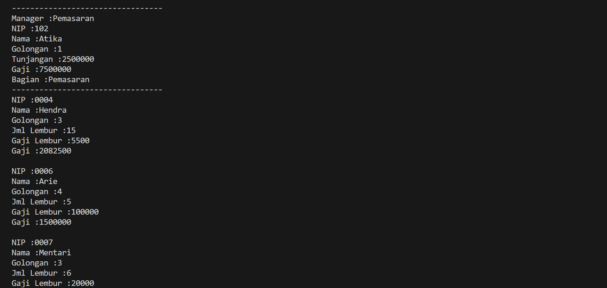

---

### Latihan

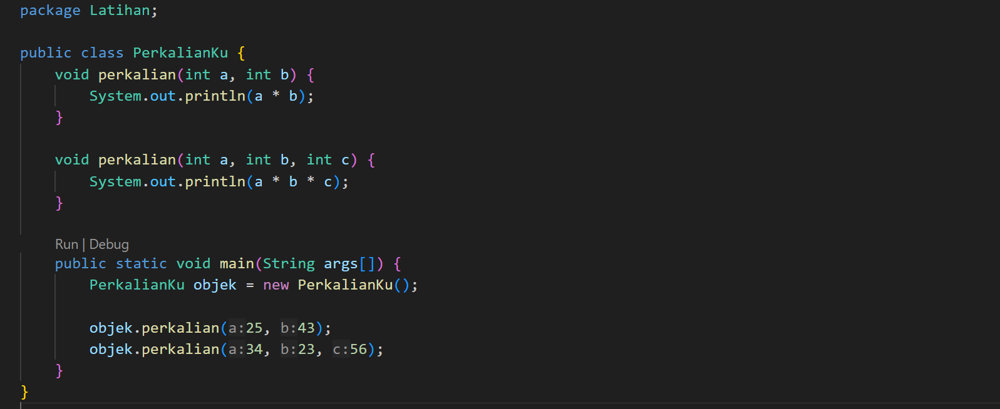

Hasil Percobaan:

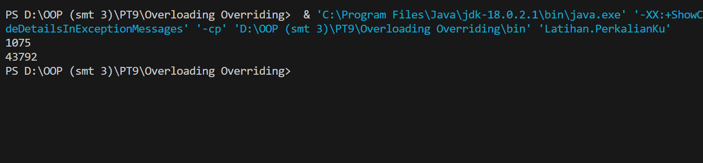

---

4.1 Dari source coding diatas terletak dimanakah overloading?

**Jawab:**
Overloading terletak pada method perkalian pada class PerkaianKu. Method perkalian di-overload menjadi 2 bentuk yg berbeda, yaitu void perkalian(int a, int b) dan void perkalian(int a, int b, int c)

4.2 Jika terdapat overloading ada berapa jumlah parameter yang berbeda?

**Jawab:**
Ada 2 parameter yang berbeda, diantaranya:

1. void perkalian(int a, int b) - Menerima dua parameter dan menghitung perkalian dari kedua parameter tersebut.

2. void perkalian(int a, int b, int c) - Menerima tiga parameter dan menghitung perkalian dari ketiga parameter tersebut.

---

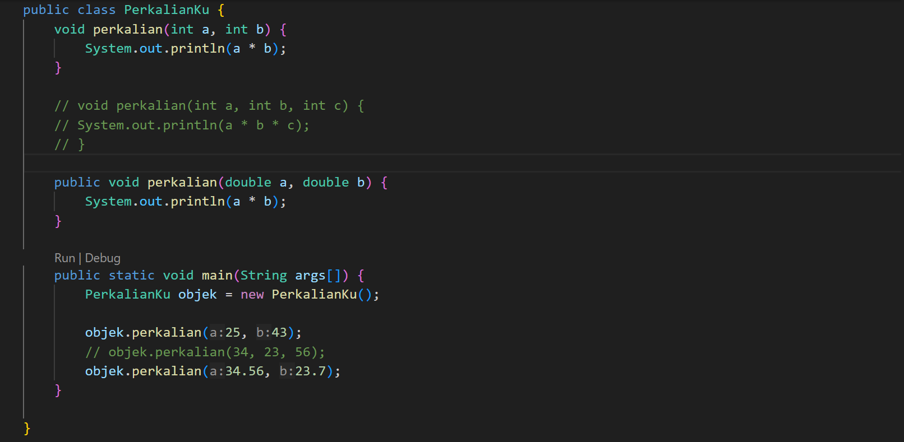

Hasil Percobaan:

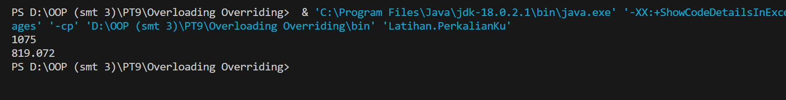

---

4.3 Dari source coding diatas terletak dimanakah overloading?

**Jawab:**
Overloading terletak pada method perkalian pada class PerkaianKu. Method perkalian di-overload menjadi 2 bentuk yg berbeda, yaitu void perkalian(int a, int b) dan void perkalian(double a, double b)

4.4 Jika terdapat overloading ada berapa tipe parameter yang berbeda?

**Jawab:**
Ada 2 parameter yang berbeda, diantaranya:

1. perkalian(int a, int b), yaitu mengambil dua parameter bertipe data integer (int).

2. perkalian(double a, double b), yaitu mengambil dua parameter bertipe data double (double).

---

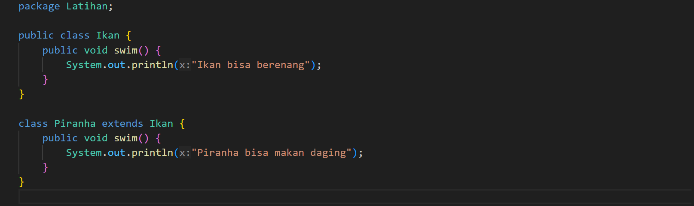
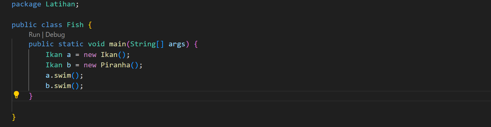

Hasil Percobaan:

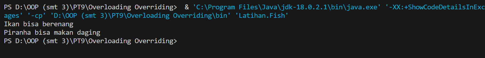

---

4.5 Dari source coding diatas terletak dimanakah overriding?

**Jawab:**
Overriding terletak pada metode swim di kelas Piranha, yang merupakan subclass dari Ikan. Overriding terjadi ketika metode swim di kelas Piranha menggantikan (override) metode swim di kelas Ikan.

4.6 Jabarkanlah apabila sourcoding diatas jika terdapat overriding?

**Jawab:**
Dalam class Fish, saat pemanggilan method swim untuk objek a, maka akan mencetak "Ikan bisa berenang". Lalu pada saat pemanggilan method swim untuk objek b, karena objek b sebenarnya adalah instance dari kelas Piranha, maka metode swim yang dijalankan adalah yang di kelas Piranha, dan akan mencetak "Piranha bisa makan daging"

### Tugas

**Overloading**

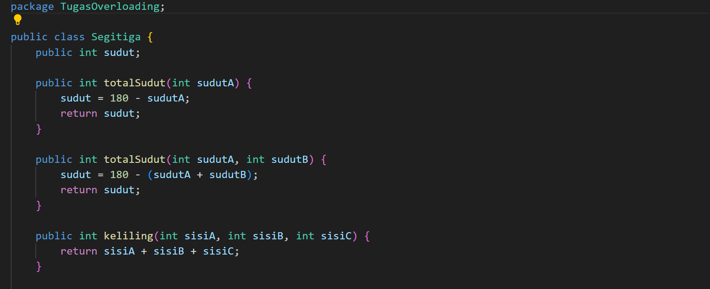

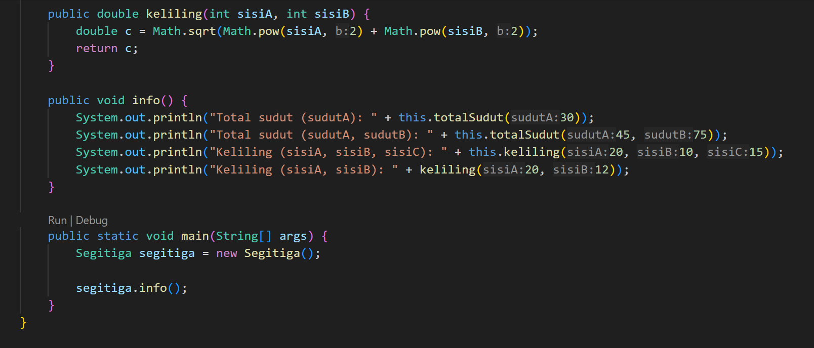

Hasil Percobaan:

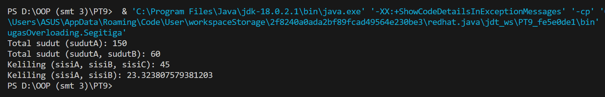

---

**Overriding**

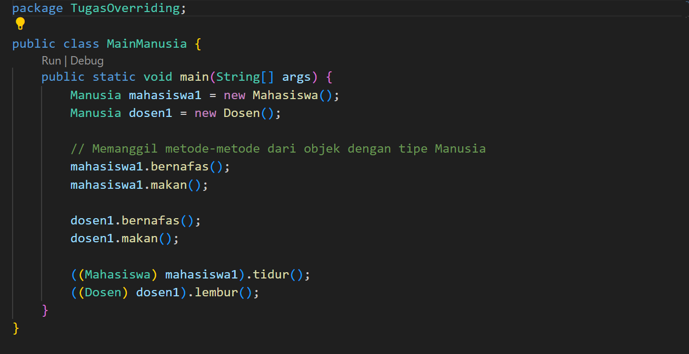

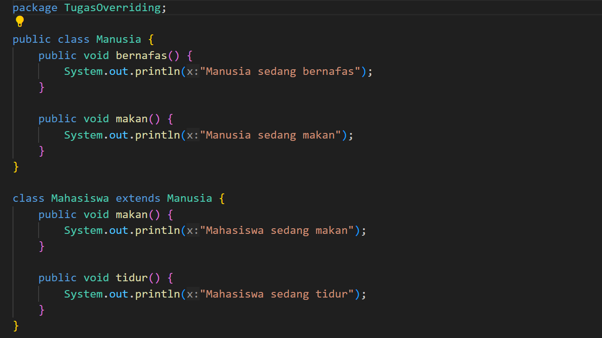

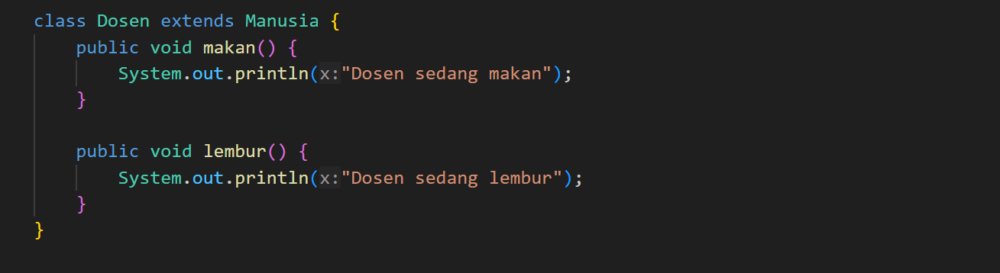

Hasil Percobaan:

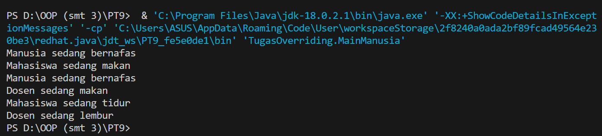
