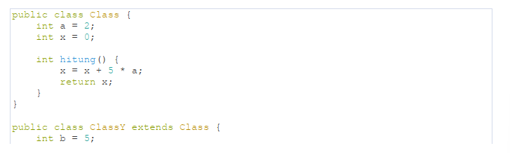

# UTS Pemrograman Berbasis Objek

Nama: Tyase Nisa'an Jamilaa

Kelas: 2C

NIM: 2241720012

---

### Soal 1: Penulisan Class

Berdasarkan contoh class ClassA di bawah ini, jelaskan apakah penulisan source code pada contoh class tersebut sudah benar. Jika tidak, apa yang perlu diperbaiki?

**Jawab:** Ya, terdapat kesalahan pada kode tersebut karena tidak adanya pernyataan return dalam kode, karena saat mendeklarasikan menggunakan tipe data float maka diharuskan untuk mengembalikannya dengan return. Perbaikan kode adalah sebagai berikut ini:

### Soal 2: Perhitungan Jumlah Elemen Array 2 Dimensi

Pada class SoalArray1, terdapat array 2 dimensi dengan ukuran 3x3. Tuliskan code Java untuk menghitung jumlah total elemen array tersebut dengan menggunakan perulangan.

**Jawab:**

Perbaikan kode:

Hasil kode program:

### Soal 3: Pewarisan Atribut dan Method

Pada source code yang diberikan, class ClassY merupakan turunan dari class Class. Sebutkan atribut dan method apa saja yang diwarisi oleh ClassY dari kelas induknya (class Class). Jelaskan juga apa output dari code yang ditulis pada class ClassY dan bagaimana nilai tersebut diperoleh.

**Jawab:** Atribut yang diwarisi oleh ClassY dari super class adalah int a (variabel dengan nilai 2), sementara method yang diwarisi ClassY dari super class adalah int hitung() yaitu method yang mengubah nilai x dengan cara menambahkan 5 \* a ke x dan mengembalikan nilai x.

Cara kerja kode program ini adalah dengan memanggil method hitung() yang ada di super class, yaitu a = 2, x = 5, sehingga hasil x = x + 5 _ a adalah 10. Kemudian method hitungY() b = 5, sehingga 10 _ 5 = 50. Jadi output yang diperoleh pada method main adalah 50.

### Soal 4: Class Mahasiswa dengan Constructor

Dalam class Mahasiswa, lengkapi code dengan:

a. Menambahkan constructor untuk mengisi atribut nim, nama, alamat, dan jenisKelamin.

b. Membuat objek mahasiswa dan mengisi atribut nim, nama, alamat, dan jenisKelamin melalui
constructor.

**Jawab:**

Perbaikan kode:

Hasil kode program:

### Soal 5: OOP Buku -> Penulis

Perhatikan class diagaram berikut dan Buatlah Source code dalam Bahasa java berdasarkan class
diagram tersebut

**Jawab:**

Kode:

Hasil kode pemrograman:

