# Laporan Praktikum

### Pemrograman Berbasis Objek

Nama: Tyase Nisa'an Jamilaa

Kelas: 2C

NIM: 2241720012

### Percobaan 1 = Enkapsulasi

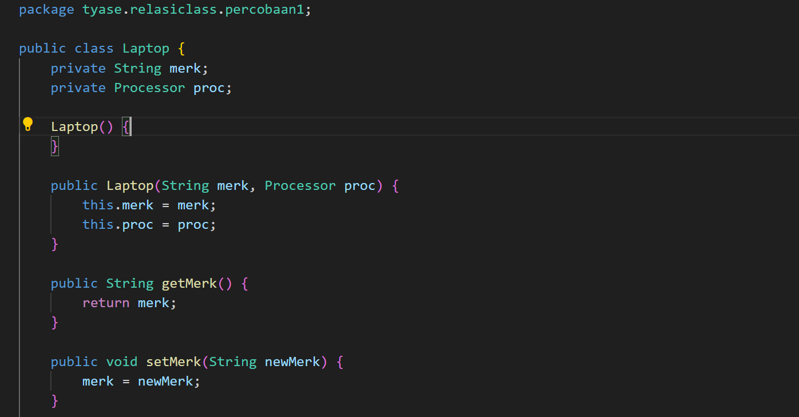
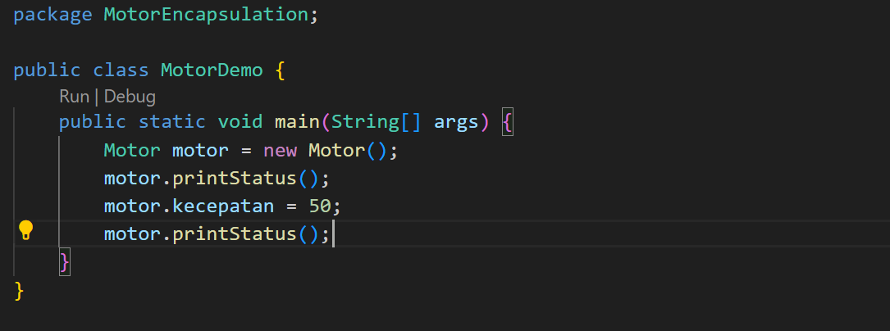

Hasil Percobaan:

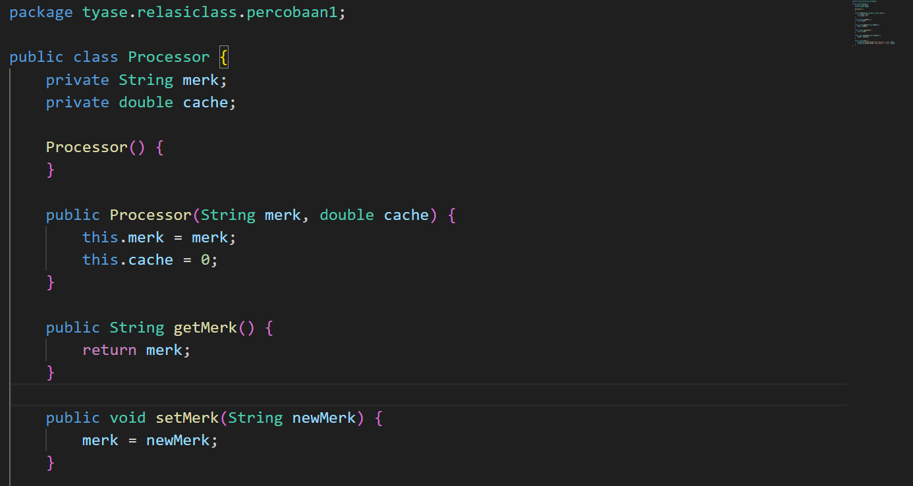

---

### Percobaan 2 - Access Modifier

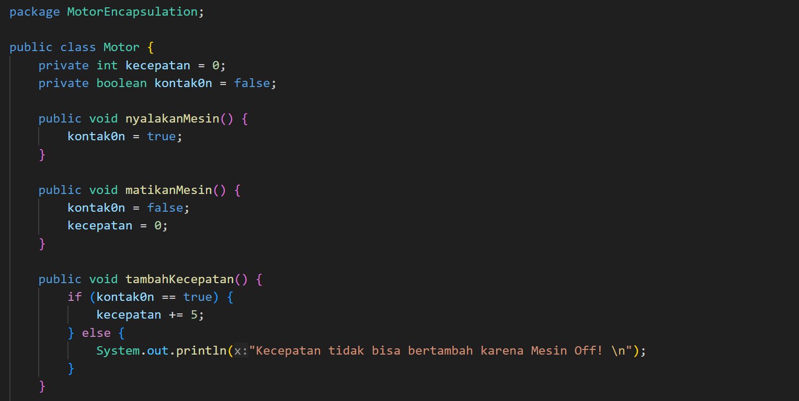
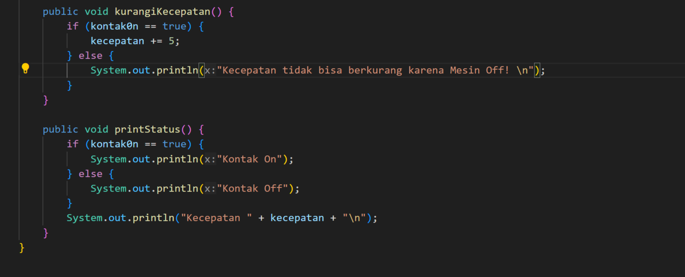
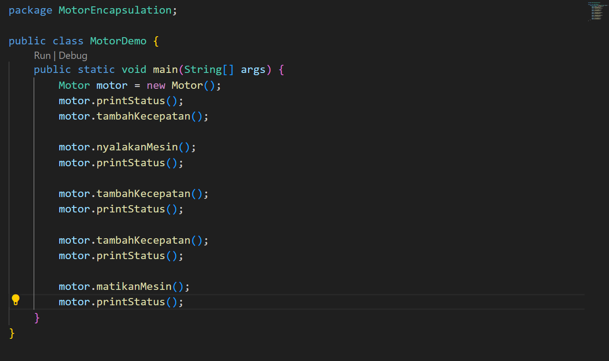

Hasil Percobaan:

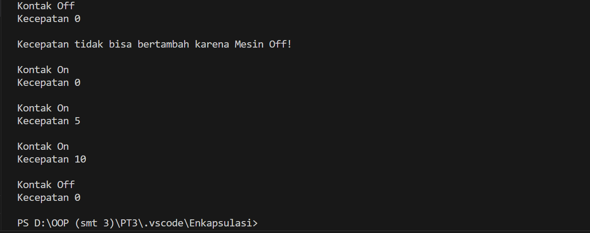

---

**Pertanyaan**

1.  Pada class TestMobil, saat kita menambah kecepatan untuk pertama kalinya, mengapa
    muncul peringatan “Kecepatan tidak bisa bertambah karena Mesin Off!”?

        **Jawab:**
        Peringatan “Kecepatan tidak bisa bertambah karena Mesin Off!” muncul dikarenakan user mencoba menambah kecepatan motor sebelum menghidupkan mesin dengan memanggil metode nyalakanMesin().  Di dalam metode tambahKecepatan(), ada pengecekan kondisi if (kontak0n == true) yang memeriksa apakah mesin dalam keadaan hidup (kontak On) sebelum menambah kecepatan, sehingga apabila kontak dalam keadaan off maka kecepatan tidak bisa bertambah.

---

2. Mengapat atribut kecepatan dan kontakOn diset private?

   **Jawab:**
   Untuk menyembunyikan detail implementasi internal dari suatu objek dari luar kelas. Sehingga hanya metode dalam kelas "Motor" yang dapat mengakses dan memodifikasi nilai-nilai tersebut.

---

3. Ubah class Motor sehingga kecepatan maksimalnya adalah 100!

   **Jawab:**
   
   

---

### Percobaan 3 - Getter dan Setter

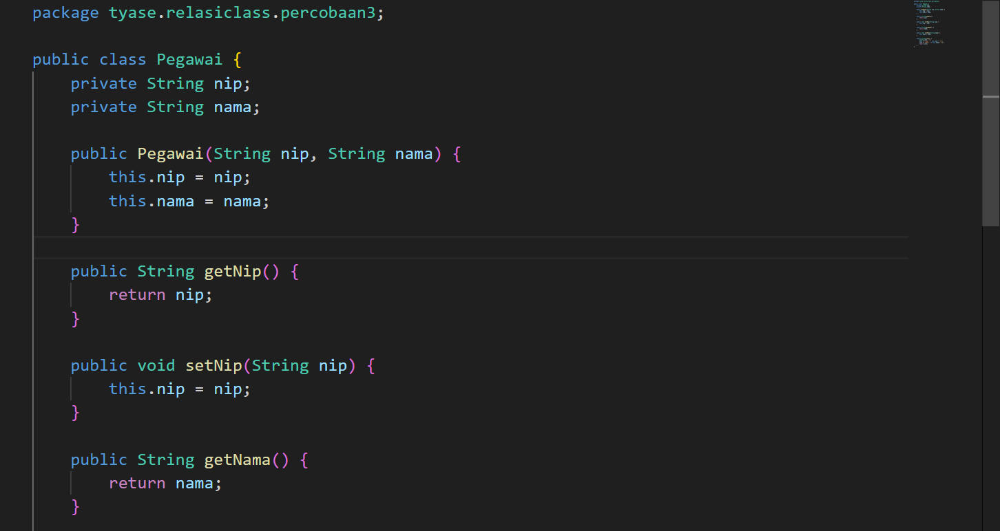
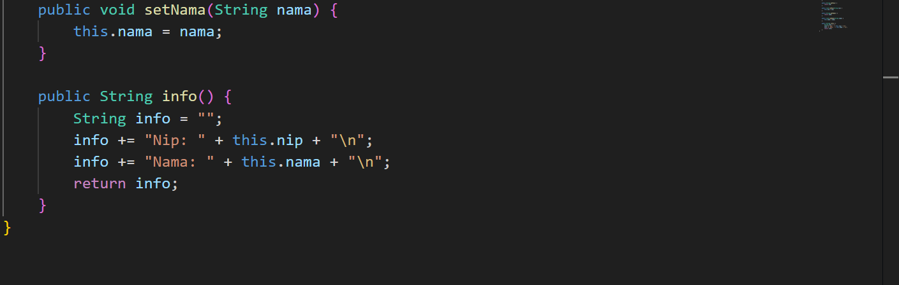
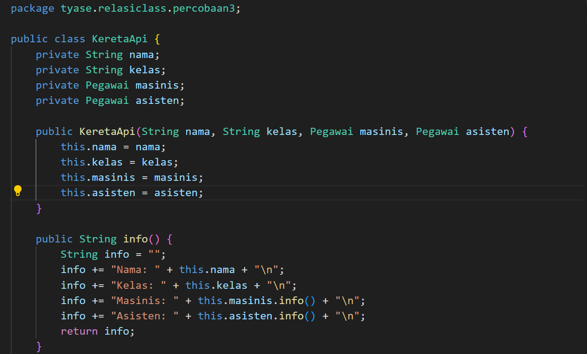

Hasil Percobaan:

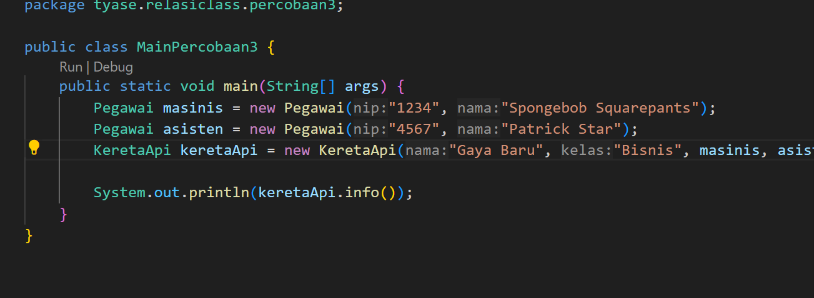

### Percobaan 4 - Konstruktor, Instansiasi

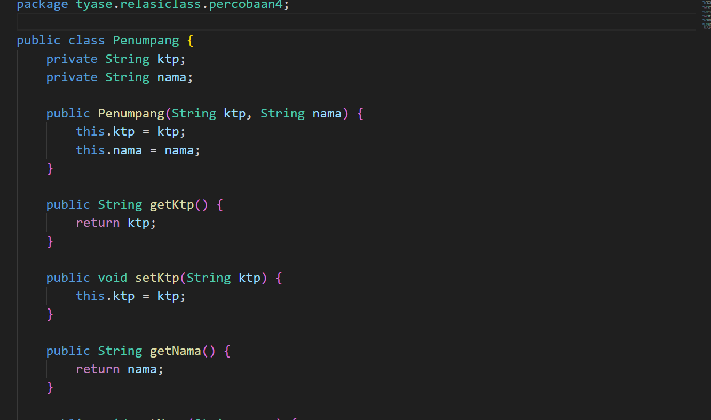

Hasil Percobaan:

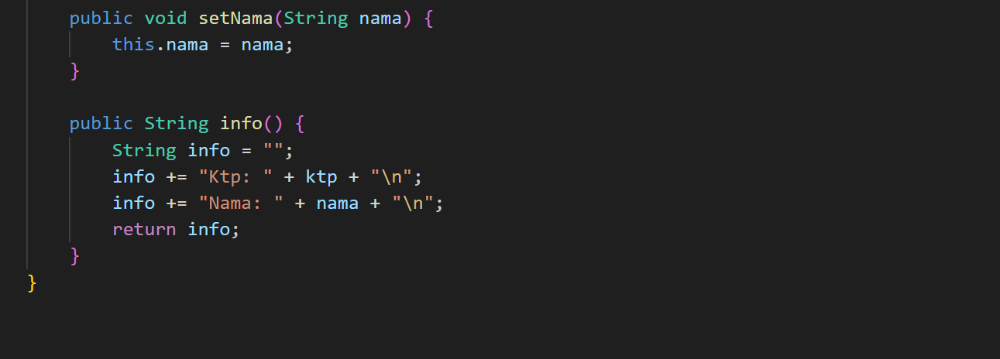

---

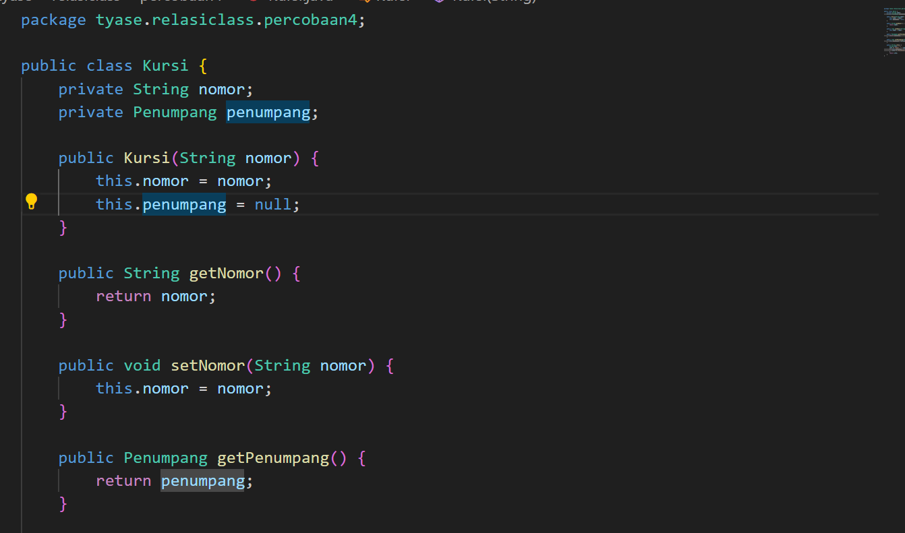
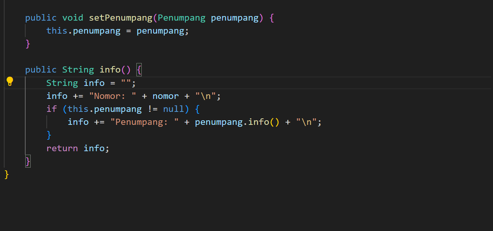

Hasil Percobaan:

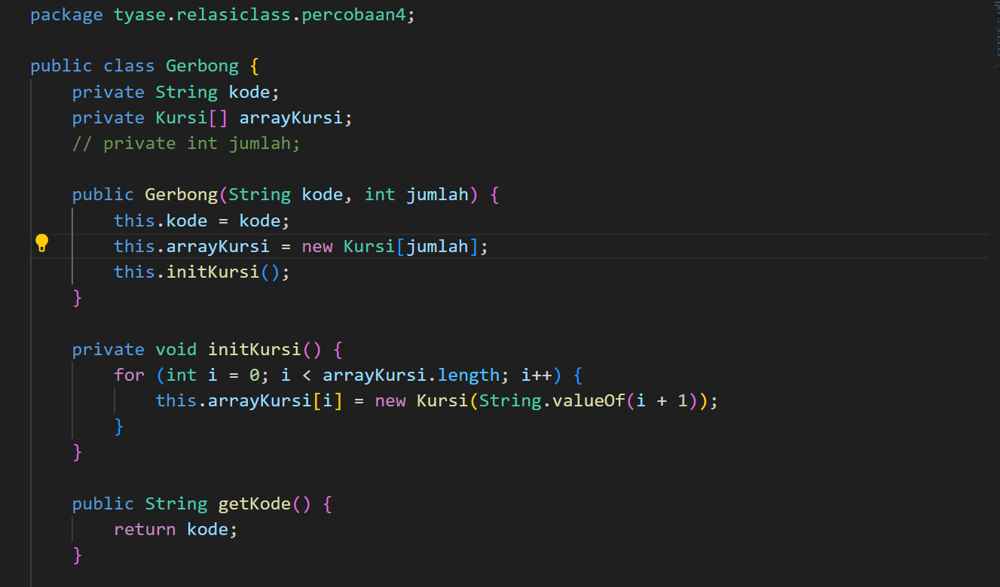

---

1. Apa yang dimaksud getter dan setter?

   **Jawab:**
   **Getter** adalah metode yang digunakan untuk mengambil nilai dari sebuah atribut atau properti objek. Metode ini umumnya digunakan untuk membaca atau mengakses data tanpa memungkinkan akses langsung ke data tersebut.

   **Setter** adalah metode yang digunakan untuk mengatur nilai dari sebuah atribut atau properti objek. Metode ini digunakan untuk memodifikasi atau mengubah data atribut objek tanpa memungkinkan akses langsung ke atribut tersebut.

---

2. Apa kegunaan dari method getSimpanan()?

   **Jawab:**
   untuk mengambil (membaca) nilai dari atribut simpanan objek Anggota. Ini adalah contoh dari penggunaan getter, yang memungkinkan Anda untuk mendapatkan nilai dari atribut simpanan tanpa perlu mengakses langsung ke atribut tersebut.

---

3. Method apa yang digunakan untk menambah saldo?

   **Jawab:**
   Method untuk menambah saldo adalah setor(float uang) dikarenakan method tersebut berfungsi untuk menambahkan uang ke method saldo dengan memasukkan nilai uang yang diinginkan user. Method ini akan menambahkan nilai uang ke nilai simpanan yang ada.

---

4. Apa yand dimaksud konstruktor?

   **Jawab:**
   Konstruktor adalah method tertentu yang diekseskusi pada saat pembuatan objek (instansiasi) dan digunakan untuk mempersiapkan data untuk objek (inisialisasi). Konstruktor dapat digunakan untuk memberikan atau mendefinisikan nilai awal pada sebuah variable atau object di dalam class.

---

5. Sebutkan aturan dalam membuat konstruktor?

   **Jawab:**
   Nama constructor harus sama dengan nama class dan tidak memiliki nilai return, konstruktor tidak boleh memiliki tipe pengembalian eksplisit, konstruktor dapat memiliki parameter atau tidak.

---

6. Apakah boleh konstruktor bertipe private?

   **Jawab:**
   Boleh, konstruktor private digunakan untuk membatasi pembuatan objek dari suatu class. Dengan membuat konstruktor private, kita dapat memastikan bahwa objek hanya dapat dibuat di dalam class itu sendiri dan tidak dapat dibuat di luar class.

---

7. Kapan menggunakan parameter dengan passsing parameter?

   **Jawab:**
   Pada saat menginisialisasi objek dengan nilai awal yang berbeda. Kita perlu menggunakan konstruktor berparameter ketika kita ingin menginisialisasi objek dengan nilai tertentu dan kita perlu menggunakan konstruktor non-parameter ketika kita ingin menginisialisasi objek dengan nilai default yang ditentukan.

---

8. Apa perbedaan atribut class dan instansiasi atribut?

   **Jawab:**
   Atribut class adalah variabel yang dideklarasikan di dalam class dan digunakan untuk menyimpan data yang bersifat umum untuk semua objek yang dibuat dari class tersebut.

   Instansiasi atribut adalah proses membuat variabel di dalam objek yang digunakan untuk menyimpan data yang bersifat khusus untuk objek tersebut.

---

9. Apa perbedaan class method dan instansiasi method?

   **Jawab:**

   **Class method** adalah method yang terkait dengan class itu sendiri dan bukan dengan objek yang dibuat dari class tersebut. Class method dapat diakses menggunakan nama class tanpa harus membuat objek dari class tersebut.

   **Instansiasi** method adalah method yang terkait dengan objek yang dibuat dari class tersebut. Instansiasi method hanya dapat diakses melalui objek yang dibuat dari class tersebut.

### Tugas

1. Cobalah program dibawah ini dan tuliskan hasil outputnya.
   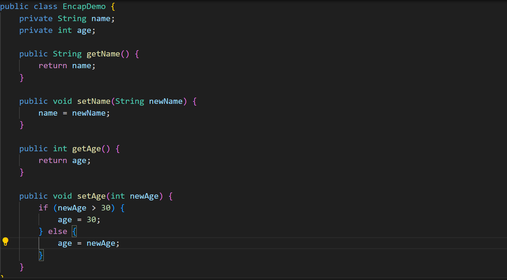

      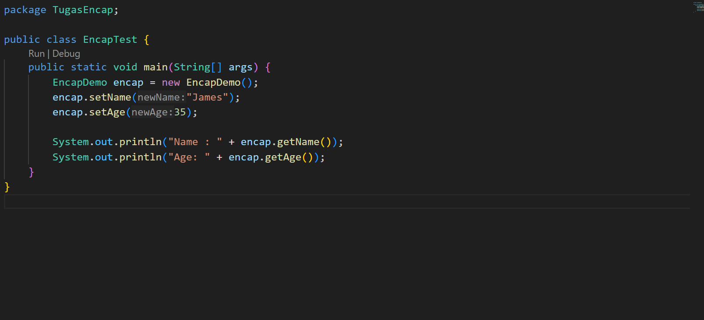

   Hasil Percobaan:
   

---

2. Pada program diatas, pada class EncapTest kita mengeset age dengan nilai 35, namun pada
   saat ditampilkan ke layar nilainya 30, jelaskan mengapa.

   **Jawab:** Hal ini terjadi karena dalam method setAge(int newAge) dari class EncapDemo. Jika newAge (nilai yang kita set) lebih besar dari 30, maka nilai age akan diatur menjadi 30. Ini adalah cara untuk membatasi usia agar tidak melebihi 30. Jika newAge kurang dari atau sama dengan 30, maka nilai age akan diatur sesuai dengan nilai newAge yang kita set.

---

3. Ubah program diatas agar atribut age dapat diberi nilai maksimal 30 dan minimal 18
   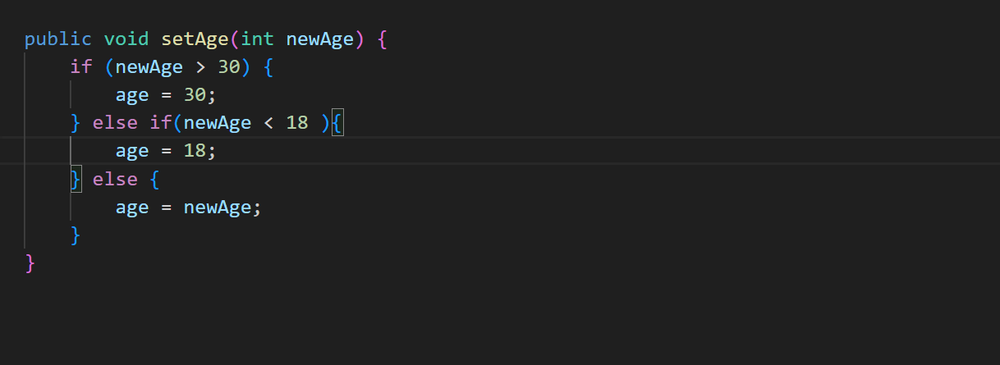

---

4. Pada sebuah sistem informasi koperasi simpan pinjam, terdapat class Anggota yang memiliki
   atribut antara lain nomor KTP, nama, limit peminjaman, dan jumlah pinjaman. Anggota
   dapat meminjam uang dengan batas limit peminjaman yang ditentukan. Anggota juga dapat
   mengangsur pinjaman. Ketika Anggota tersebut mengangsur pinjaman, maka jumlah
   pinjaman akan berkurang sesuai dengan nominal yang diangsur. Buatlah class Anggota
   tersebut, berikan atribut, method dan konstruktor sesuai dengan kebutuhan. Uji dengan
   TestKoperasi berikut ini untuk memeriksa apakah class Anggota yang anda buat telah sesuai dengan yang diharapkan.
   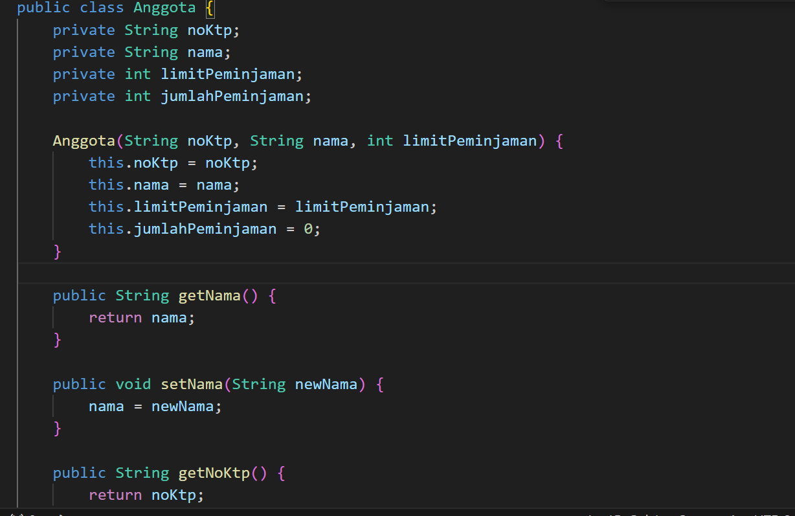
   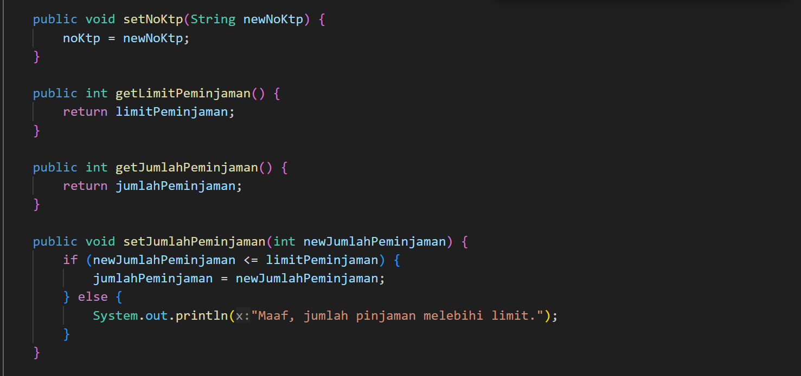
   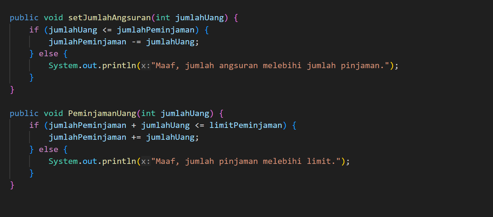
   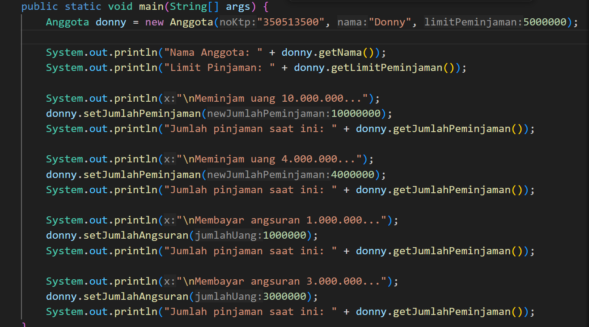

   Hasil Percobaan:
   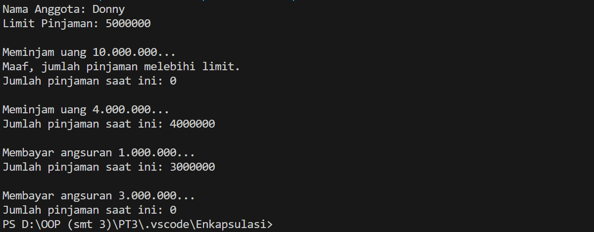

---

5. Modifikasi soal no. 4 agar nominal yang dapat diangsur minimal adalah 10% dari jumlah
   pinjaman saat ini. Jika mengangsur kurang dari itu, maka muncul peringatan “Maaf,
   angsuran harus 10% dari jumlah pinjaman”.
   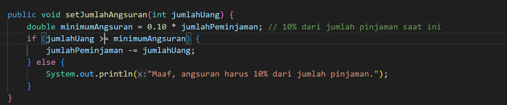

   Hasil Percobaan:
   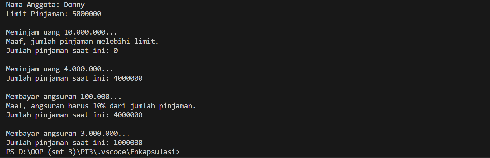

---

6. Modifikasi class TestKoperasi, agar jumlah pinjaman dan angsuran dapat menerima input
   dari console.
   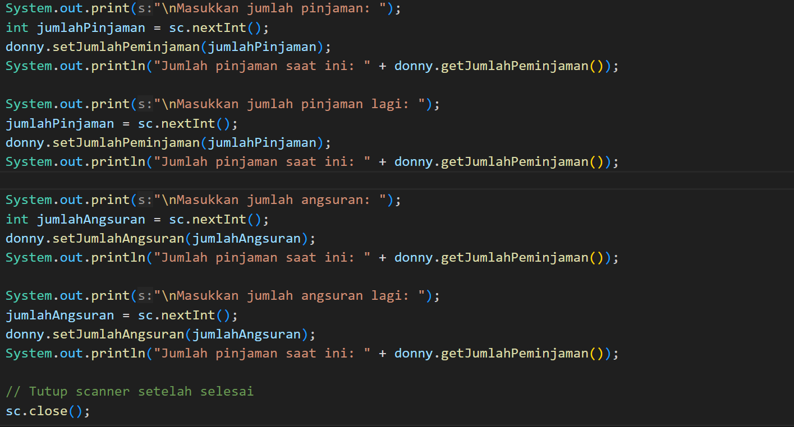
