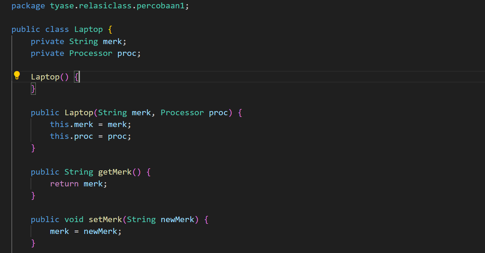
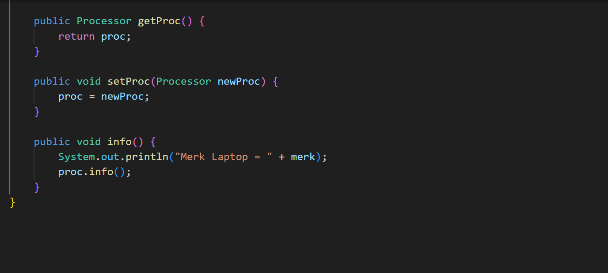
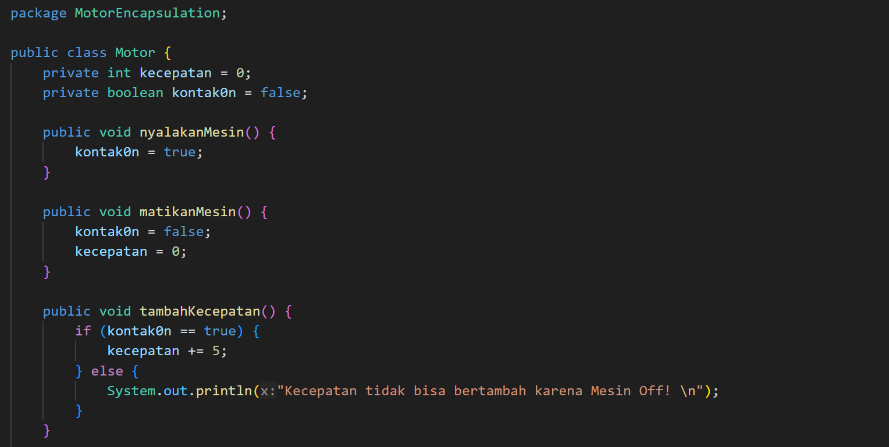

# Laporan Praktikum

### Pemrograman Berbasis Objek

Nama: Tyase Nisa'an Jamilaa

Kelas: 2C

NIM: 2241720012

---

### Percobaan 1

Hasil Pengerjaan:

---

### Pertanyaan

Berdasarkan percobaan 1, jawablah pertanyaan‑pertanyaan yang terkait:

1. Di dalam class Processor dan class Laptop , terdapat method setter dan getter untuk masing‑masing atributnya. Apakah gunanya method setter dan getter tersebut ?

   **Jawab:**
   Metode setter digunakan untuk mengatur nilai pada atribut class Prosessor dan class Laptop, sementara metode getter digunakan untuk mengambil nilai dalam suatu atribut.

---

2. Di dalam class Processor dan class Laptop, masing‑masing terdapat konstruktor default dan konstruktor berparameter. Bagaimanakah beda penggunaan dari kedua jenis konstruktor tersebut ?

   **Jawab:**
   Konstruktor default: Konstruktor yang tidak memiliki parameter, konstruktor akan secara otomatis dipanggil ketika Anda membuat objek dari class Processor tanpa menyediakan nilai apapun.

   Konstruktor berparameter: Konstruktor yang menerima parameter saat membuat objek dari class.

---

3. Perhatikan class Laptop, di antara 2 atribut yang dimiliki (merk dan proc), atribut manakah yang bertipe object ?

   **Jawab:**
   Atribut yang bertipe object adalah proc, karena proc memiliki tipe data Processor, yang berarti ia adalah sebuah objek dari class Processor.

---

4.  Perhatikan class Laptop, pada baris manakah yang menunjukan bahwa class Laptop
    memiliki relasi dengan class Processor ?

        **Jawab:**

        

        Dengan kode tersebut menunjukan bahwa class Laptop dapat memiliki akses ke objek Processor, dan Anda dapat mengakses metode dan atribut dari class Processor.

---

5. Perhatikan pada class Laptop , Apakah guna dari sintaks proc.info() ?

   **Jawab:**
   Digunakan untuk memanggil method info() dari objek proc yang merupakan instansiasi dari class Processor. Sehingga ketika memanggil method info() pada objek Laptop, akan mencetak merk laptop yang kemudian memanggil method info() pada objek proc yang akan mencetak informasi tentang processor yang terpasang di dalam laptop tersebut.

---

6. Pada class MainPercobaan1, terdapat baris kode:

   Laptop l = new Laptop("Thinkpad", p);.

   Apakah p tersebut ?

   Dan apakah yang terjadi jika baris kode tersebut diubah menjadi:

   Laptop l = new Laptop("Thinkpad", new Processor("Intel i5", 3));

   Bagaimanakah hasil program saat dijalankan, apakah ada perubahan ?

   **Jawab:**
   p merupakan objek dari class Processor. Dengan kata lain, p adalah sebuah instansiasi atau objek dari class Processor.

   Apabila kode diubah seperti gambar berikut:

   

   Maka tidak akan ada perubahan saat program dijalankan, hal ini dikarenakan keduanya menciptakan objek Laptop yang sama dengan parameter yang sama, yaitu merk "Thinkpad" dan objek Processor dengan merk "Intel i5" dan cache 3.

   ***

### Percobaan 2

Hasil Percobaan:

---

### Pertanyaan

---

1.  Perhatikan class Pelanggan. Pada baris program manakah yang menunjukan bahwa class
    Pelanggan memiliki relasi dengan class Mobil dan class Sopir ?

        **Jawab:**
        

---

2. Perhatikan method hitungBiayaSopir pada class Sopir, serta method hitungBiayaMobil pada class Mobil. Mengapa menurut Anda method tersebut harus memiliki argument hari ?

   **Jawab:**
   Method hitungBiayaMobil memiliki argument hari untuk menghitung biaya berdasarkan jumlah sewa perhari, yaitu biaya\*hari.

---

3.  Perhatikan kode dari class Pelanggan. Untuk apakah perintah
    mobil.hitungBiayaMobil(hari) dan sopir.hitungBiayaSopir(hari) ?

    **Jawab:**
    Method mobil.hitungBiayaMobil(hari) digunakan untuk menghitung biaya yang harus dibayar pelanggan berdasarkan sewa mobil perhari, sementara method hitungBiayaSopir(hari) digunakan untuk menghitung biaya yang harus dibayar pelanggan berdasarkan sewa sopir perhari. Kemudian, dalam method hitungBiayaTotal pada class Pelanggan, kedua biaya (biaya mobil dan biaya sopir) dijumlahkan untuk menghasilkan total biaya yang harus dibayar oleh pelanggan.

---

4. Perhatikan class MainPercobaan2. Untuk apakah sintaks p.setMobil(m) dan
   p.setSopir(s) ?

   **Jawab:**
   p.setMobil(m) digunakan untuk mengatur objek pada class Mobil dan p.setSopir(s) untuk mengatur objek pada class Sopir dalam objek Pelanggan (variabel p).

---

5. Perhatikan class MainPercobaan2. Untuk apakah proses p.hitungBiayaTotal()
   tersebut ?

   **Jawab:**
   Untuk menghitung biaya total berdasarkan mobil dan sopir sesuai dengan durasi sewa yang ditentukan.

---

6. Perhatikan class MainPercobaan2, coba tambahkan pada baris terakhir dari method main dan amati perubahan saat di‑run!

   System.out.println(p.getMobil().getMerk());

   Jadi untuk apakah sintaks p.getMobil().getMerk() yang ada di dalam method main tersebut?

   **Jawab:**
   

   p.getMobil().getMerk() untuk mengambil merk mobil yang dimiliki oleh pelanggan p dan mengembalikan nilai merk mobil tersebut.

---

### Percobaan 3

Hasil Percobaan:

---

### Pertanyaan

1.  Di dalam method info() pada class KeretaApi, baris this.masinis.info() dan
    this.asisten.info() digunakan untuk apa ?

    **Jawab:**
    Untuk mengambil informasi tentang pegawai masinis dan asisten yang bekerja pada kereta api. Hal ini akan memberikan informasi lengkap tentang kereta api, termasuk detail tentang masinis dan asisten yang bekerja di kereta api.

---

2. Buatlah main program baru dengan nama class MainPertanyaan pada package yang sama. Tambahkan kode berikut pada method main() !

   Pegawai masinis = new Pegawai("1234", "Spongebob Squarepants");

   KeretaApi keretaApi = new KeretaApi("Gaya Baru", "Bisnis", masinis);

   System.out.println(keretaApi.info());

   **Jawab:**

   

---

3. Apa hasil output dari main program tersebut ? Mengapa hal tersebut dapat terjadi ?

   **Jawab:**
   Hasil error dikarenakan pernyataan objek KeretaApi dalam method main tidak sesuai dikarenakan hanya menyediakan 3 argumen, sedangkan konstruktor class KeretaApi membutukan 4 argumen, oleh karena itu kita memerlukan untuk membuat construktor baru pada class KeretaApi.

---

4. Perbaiki class KeretaApi sehingga program dapat berjalan !

   **Jawab:**

   

   

   Hasil Percobaan:

   

---

### Percobaan 4

Hasil Percobaan:

### Pertanyaan

1. Pada main program dalam class MainPercobaan4, berapakah jumlah kursi dalam Gerbong A ?

   **Jawab:**
   10 kursi, sesuai dengan argumen yang diberkan dalam objek Gerbong

---

2. Perhatikan potongan kode pada method info() dalam class Kursi. Apa maksud kode tersebut ?

...

if (this.penumpang != null) {

info += "Penumpang: " + penumpang.info() + "\n";

}

...

**Jawab:**
kode if (this.penumpang != null) untuk mengecek apakah penumpang null atau tidak, apabila penumpang tidak null berarti ada yang duduk di kursi tersebut, sehingga kondisi ini mengecek kalau kursi kosong atau tidak.

info += "Penumpang: " + penumpang.info() + "\n"; kondisi apabila penumpang tidak null maka akan menambahkan informasi tentang penumpang ke dalam string info.

---

3. Mengapa pada method setPenumpang() dalam class Gerbong, nilai nomor dikurangi dengan angka 1 ?

   **Jawab:**
   Karena indeks array dimulai dengan 0 bukan 1, dengan mengurangi 1 nomor akses indeks array akn sesuai dengan nomor yang telah ditentukan.

---

4. Instansiasi objek baru budi dengan tipe Penumpang, kemudian masukkan objek baru tersebut pada gerbong dengan gerbong.setPenumpang(budi, 1). Apakah yang terjadi ?

   **Jawab:**
   

   Hasil Percobaan:
   

---

5. Modifikasi program sehingga tidak diperkenankan untuk menduduki kursi yang sudah ada penumpang lain !

   **Jawab:**
   

---

### Tugas

Berdasarkan latihan di pertemuan teori, rancang dengan class diagram, kemudian implementasikan ke dalam program! Studi kasus harus mewakili relasi class dari percobaan‑percobaan yang telah dilakukan pada materi ini, setidaknya melibatkan minimal 4 class (class yang berisi main tidak dihitung).

Hasil Percobaan:

